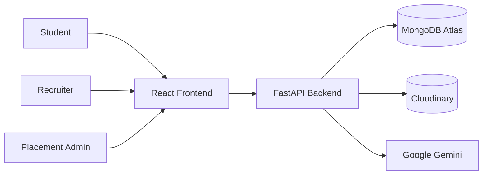
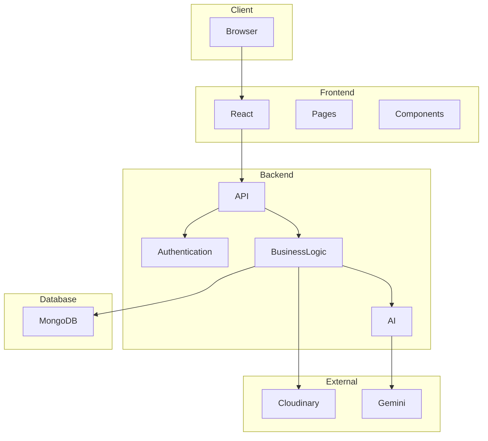
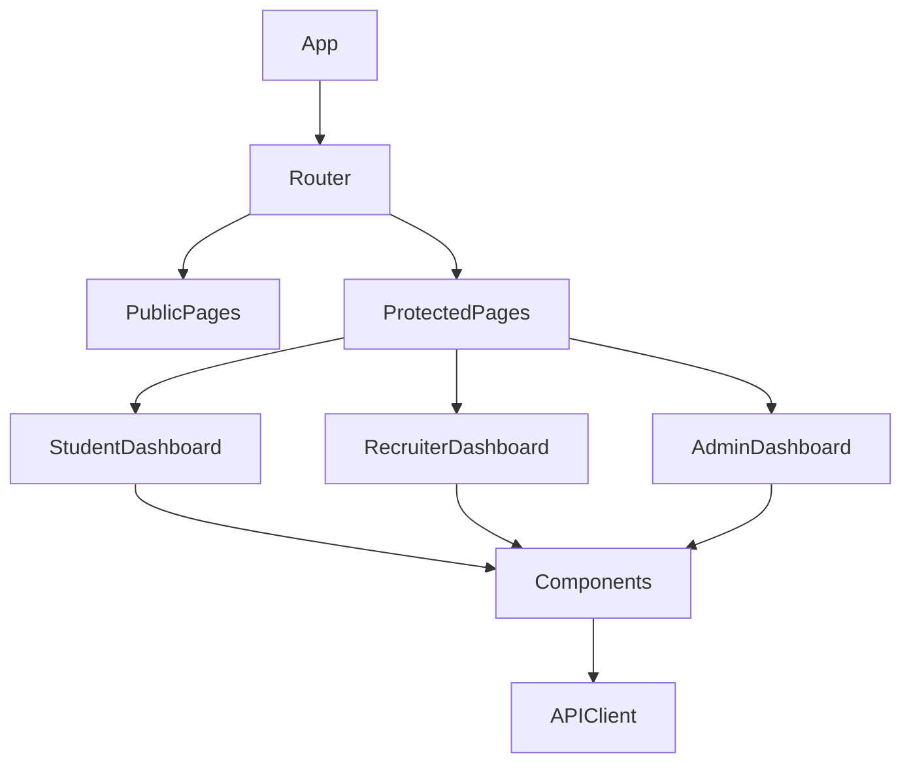
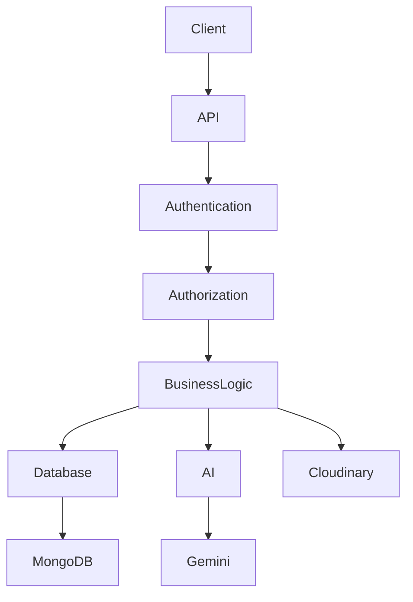
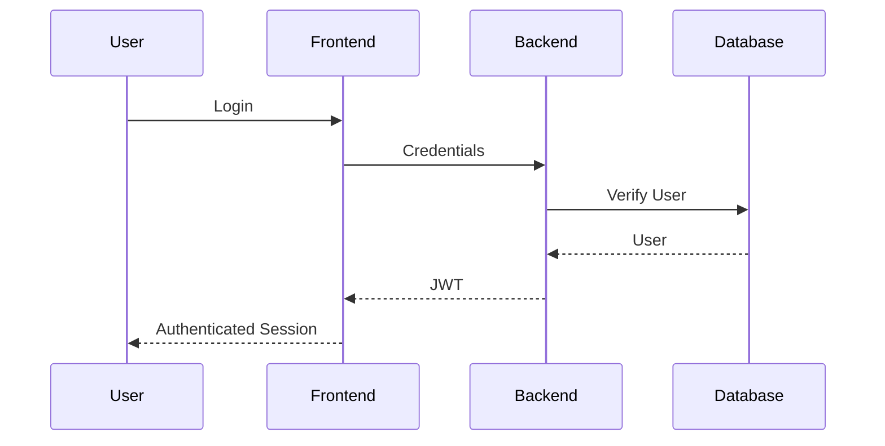
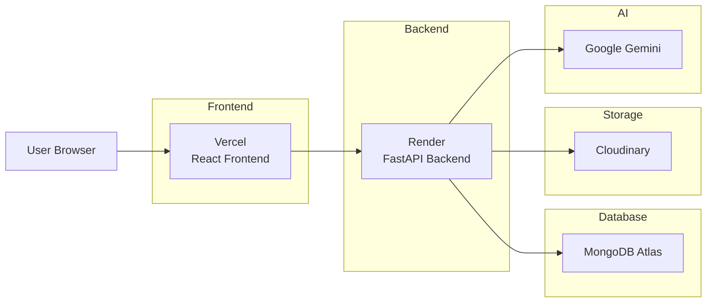
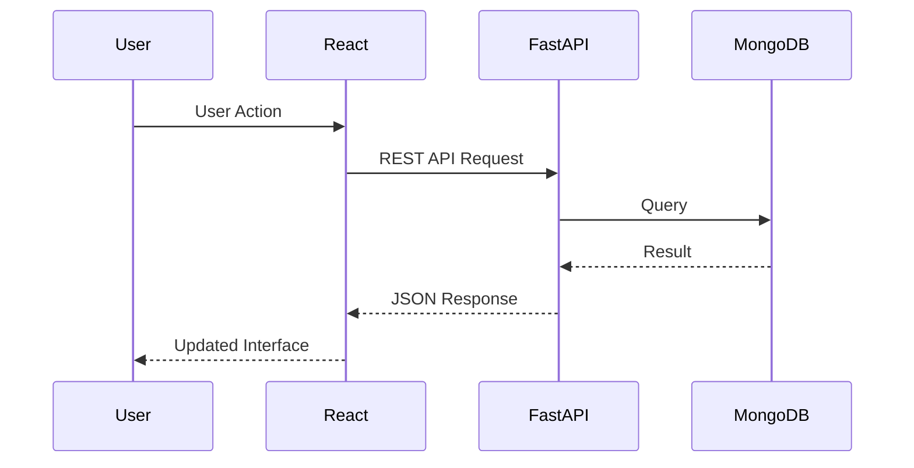
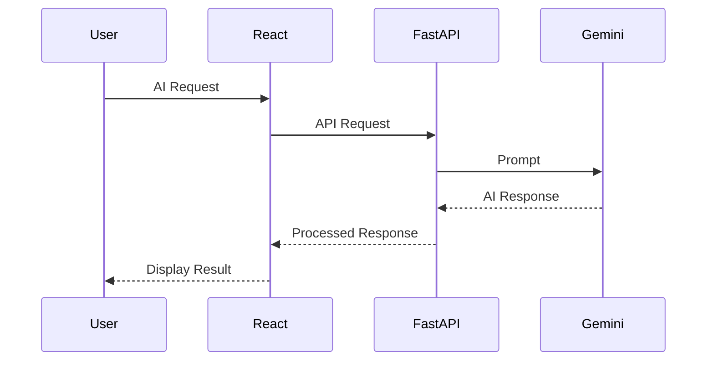

# PlacementHub Architecture

> System Architecture and High-Level Technical Design

---

## Document Information

| Field | Value |
|--------|-------|
| Document Name | Architecture |
| Project | PlacementHub |
| Version | 2.0.0 |
| Status | Draft |
| Owner | Anand Sagar |
| Scope | System Architecture |
| Parent Document | Project DNA |
| Last Updated | 2026-08-03 |

---

## Purpose

This document describes the architectural design of PlacementHub.

It explains how the frontend, backend, database, external services, and infrastructure interact to deliver the complete platform.

The architecture described here must remain consistent with the engineering principles defined in `00_PROJECT_DNA.md`.

---

## Audience

This document is intended for:

- Software Engineers
- System Architects
- Technical Reviewers
- Future Contributors
- AI Coding Assistants

---

## Authority

This document derives its architectural decisions from the Project DNA.

Implementation should remain consistent with the architecture documented here.

# Table of Contents

1. Architecture Overview
2. Design Goals
3. System Context
4. High-Level Architecture
5. Frontend Architecture
6. Backend Architecture
7. Database Architecture
8. External Services
9. Authentication Architecture
10. API Architecture
11. Request Lifecycle
12. Deployment Architecture
13. Security Architecture
14. Scalability Considerations
15. Architectural Decisions
16. Future Evolution

# Architecture Overview

PlacementHub follows a modern layered architecture based on a clear separation of concerns.

The platform is organized into independent frontend, backend, database, and cloud service layers that communicate through well-defined APIs.

The architecture emphasizes:

- Separation of Concerns
- Stateless Backend Services
- API-First Communication
- Modular Business Logic
- Cloud-Native Deployment
- Scalable Infrastructure
- AI as an Independent Service Layer

The current implementation follows a monolithic backend with modular business domains. The architecture is intentionally designed to support future evolution toward more modular or service-oriented deployments without major redesign.

---

# Design Goals

The architecture has been designed to satisfy the following engineering goals:

- High maintainability
- Clear separation of responsibilities
- Secure authentication and authorization
- Independent frontend and backend deployment
- Modular feature development
- AI integration without coupling business logic
- Scalable cloud deployment
- Easy onboarding for future contributors

---

# System Context

---

# High-Level Architecture

---

# Frontend Architecture

The frontend is implemented as a React-based Single Page Application (SPA).

It is responsible for:

- User Interface
- Client-side Routing
- Authentication State
- API Communication
- Dashboard Rendering
- Role-based Navigation
- Form Validation
- Data Visualization

## Frontend Component Architecture

---

# Backend Architecture

PlacementHub uses a layered backend architecture built with FastAPI.

Responsibilities are separated into distinct layers to improve maintainability and scalability.

## Backend Layered Architecture

---

# External Services

PlacementHub integrates with managed cloud services to provide specialized capabilities.

| Service | Responsibility |
|----------|----------------|
| MongoDB Atlas | Primary Database |
| Cloudinary | Document Storage |
| Google Gemini | AI Features |
| Render | Backend Hosting |
| Vercel | Frontend Hosting |

---

# Database Architecture

PlacementHub uses MongoDB as the primary operational database.

Data is organized into logical collections representing business domains.

Major collections include:

- Applications
- Audit Logs
- Chat Message
- Drives
- Events
- Interviews
- Jobs
- Notifications
- Password Reset OTP
- Security Logs
- Users

Detailed schema documentation is maintained separately.

---

# Authentication Architecture

Authentication is based on JWT.

Authorization is enforced using Role-Based Access Control (RBAC).

## Authentication Flow

---

# Deployment Architecture

PlacementHub is deployed using independently managed frontend and backend services with managed cloud infrastructure.

## Deployment Diagram

---

# Request Lifecycle

Every client request follows a predictable lifecycle.

## Request Flow

---

# AI Request Flow

AI capabilities are implemented as an independent service layer.

---

# Security Architecture

PlacementHub applies security controls across every architectural layer.

Primary security controls include:

- JWT-based authentication
- Role-Based Access Control (RBAC)
- Secure password hashing using bcrypt
- Signed Cloudinary uploads
- Input validation
- Protected API endpoints
- Server-side authorization
- Audit logging
- OTP-based password reset

Security is enforced within the backend and is never delegated solely to the frontend.

---

# Scalability Considerations

The current architecture supports future growth through:

- Independent frontend deployment
- Independent backend deployment
- Stateless backend services
- Cloud-managed infrastructure
- Modular business domains
- Future service decomposition
- AI service isolation
- Horizontal scaling opportunities

---

# Architectural Decisions

The following major architectural decisions define the current implementation.

| Decision | Reason |
|----------|--------|
| Monorepo structure | Simplifies project management |
| React frontend | Component-driven UI architecture |
| FastAPI backend | High-performance asynchronous APIs |
| MongoDB | Flexible schema for evolving requirements |
| JWT Authentication | Stateless authentication |
| Cloudinary | Managed cloud media storage |
| Google Gemini | AI-powered assistance |
| Vercel + Render | Independent frontend/backend deployment |

---

# Future Evolution

The architecture is intentionally designed to evolve.

Planned architectural improvements include:

- Backend modularization into routers
- Docker containerization
- CI/CD automation
- Infrastructure as Code
- Monitoring and observability
- Redis caching
- Background task processing
- Service-oriented architecture where beneficial