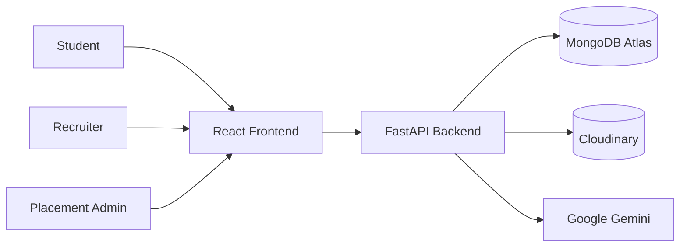
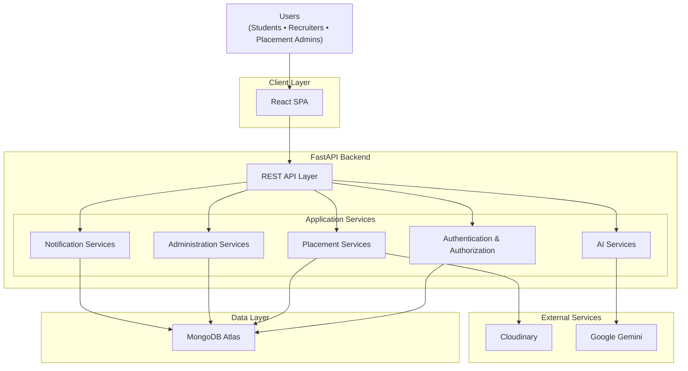
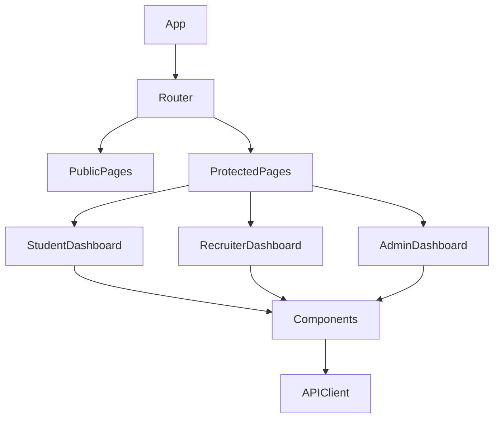
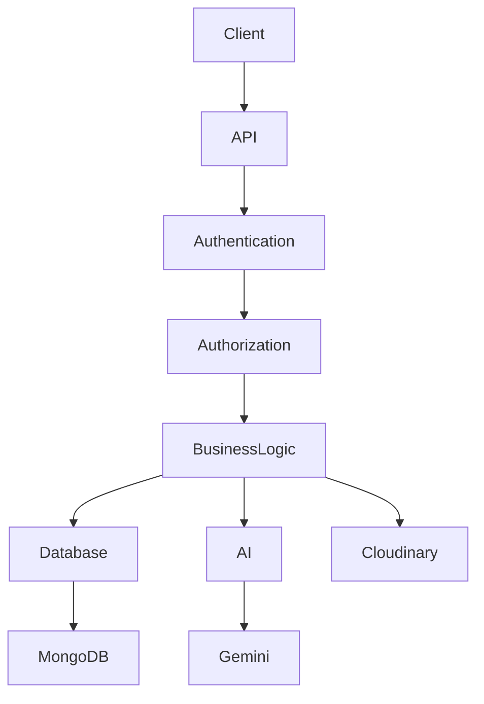
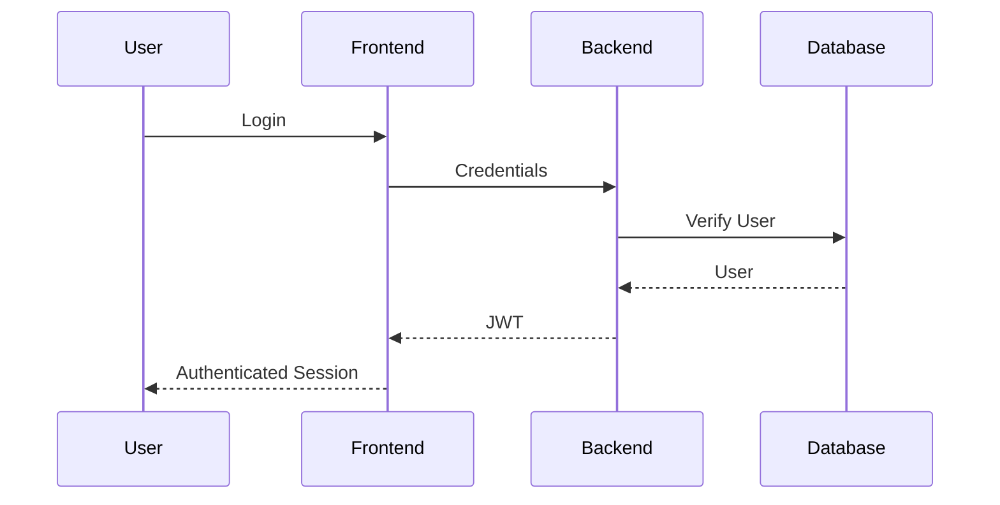
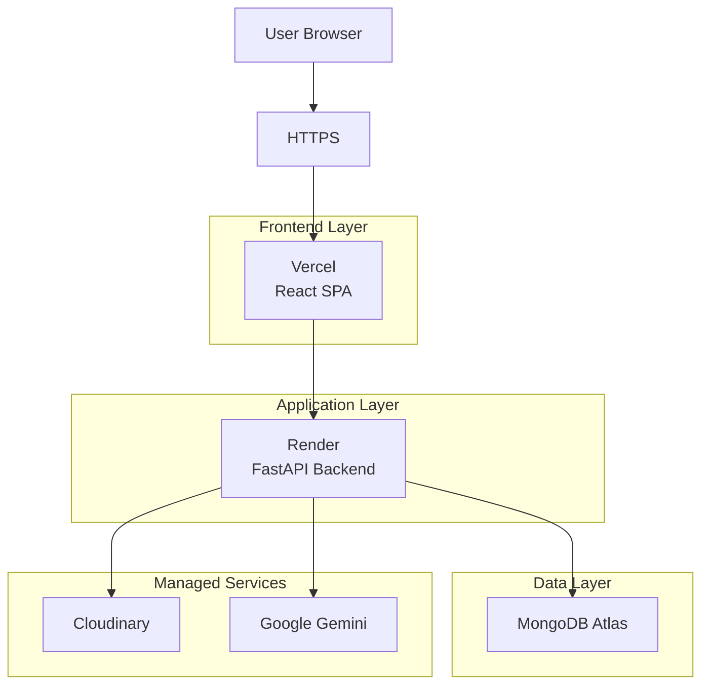
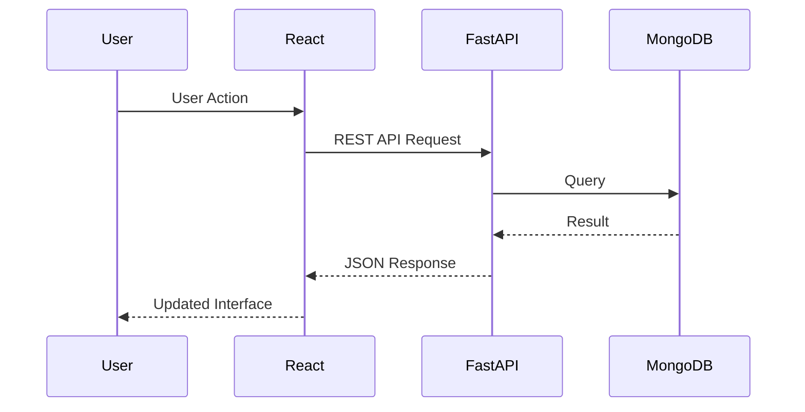
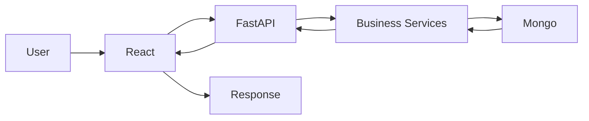
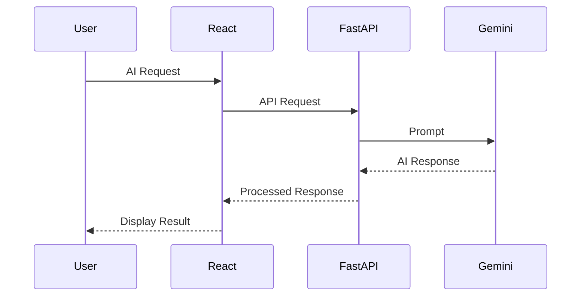
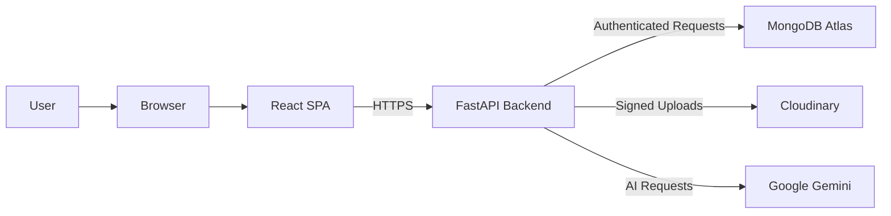

# PlacementHub Architecture

> System Architecture and High-Level Technical Design

---

## Document Information

| Field | Value |
|--------|-------|
| Document Name | Architecture |
| Project | PlacementHub |
| Version | 2.0.0 |
| Status | Draft |
| Owner | Anand Sagar |
| Scope | System Architecture |
| Parent Document | Project DNA |
| Last Updated | 2026-08-03 |

---

## Purpose

This document describes the architectural design of PlacementHub.

It explains how the frontend, backend, database, external services, and infrastructure interact to deliver the complete platform.

The architecture described here must remain consistent with the engineering principles defined in `00_PROJECT_DNA.md`.

---

## Audience

This document is intended for:

- Software Engineers
- System Architects
- Technical Reviewers
- Future Contributors
- AI Coding Assistants

---

## Authority

This document derives its architectural decisions from the Project DNA.

Implementation should remain consistent with the architecture documented here.

# Table of Contents

1. Architecture Overview
2. Design Goals
3. System Context
4. High-Level Architecture
5. Frontend Architecture
6. Backend Architecture
7. Database Architecture
8. External Services
9. Authentication Architecture
10. API Architecture
11. Request Lifecycle
12. Deployment Architecture
13. Security Architecture
14. Scalability Considerations
15. Architectural Decisions
16. Future Evolution

# Architecture Overview

PlacementHub follows a modern layered architecture based on a clear separation of concerns.

The platform is organized into independent frontend, backend, database, and cloud service layers that communicate through well-defined APIs.

The architecture emphasizes:

- Separation of Concerns
- Stateless Backend Services
- API-First Communication
- Modular Business Logic
- Cloud-Native Deployment
- Scalable Infrastructure
- AI as an Independent Service Layer

The current implementation follows a monolithic backend with modular business domains. The architecture is intentionally designed to support future evolution toward more modular or service-oriented deployments without major redesign.

---

# Design Goals

The architecture has been designed to satisfy the following engineering goals:

- High maintainability
- Clear separation of responsibilities
- Secure authentication and authorization
- Independent frontend and backend deployment
- Modular feature development
- AI integration without coupling business logic
- Scalable cloud deployment
- Easy onboarding for future contributors

---

# Architectural Style

PlacementHub follows a layered monolithic architecture with clear separation of presentation, business, persistence, and external integration layers.

The current implementation is deployed as a single backend application while maintaining logical modularity across business domains.

The architecture follows the following principles:

- Layered Architecture
- API-First Design
- Stateless Backend Services
- Modular Business Domains
- Separation of Concerns
- Cloud-Native Deployment
- Independent Frontend and Backend Deployments

The architecture intentionally favors maintainability and simplicity over premature service decomposition while preserving a clear migration path toward a service-oriented architecture if future requirements demand it.

---

# System Context

---

# High-Level Architecture

PlacementHub is organized as a set of logical containers that collaborate through clearly defined interfaces.

The React frontend serves as the presentation layer and communicates exclusively with the FastAPI backend through REST APIs. The backend contains multiple logical service domains responsible for authentication, placement operations, administration, AI capabilities, and notification management.

MongoDB Atlas serves as the primary operational datastore, while Cloudinary and Google Gemini are integrated as external platform services through dedicated backend integration layers.

---

# Container Responsibilities

Each architectural container has a clearly defined responsibility.

| Container | Primary Responsibility |
|------------|------------------------|
| React SPA | User interface, routing, client-side state management, API communication |
| REST API Layer | HTTP request handling, request validation, response generation |
| Authentication & Authorization | Identity verification, JWT processing, Role-Based Access Control |
| Placement Services | Business workflows including jobs, applications, drives, interviews, offers, and profile management |
| Administration Services | Verification workflows, recruiter approval, audit logging, platform governance |
| AI Services | AI profile review, company recommendations, conversational assistant |
| Notification Services | In-app notification generation and delivery |
| MongoDB Atlas | Persistent business data storage |
| Cloudinary | Secure document storage and media delivery |
| Google Gemini | AI inference and natural language generation |

# Frontend Architecture

The frontend is implemented as a React-based Single Page Application (SPA).

It is responsible for:

- User Interface
- Client-side Routing
- Authentication State
- API Communication
- Dashboard Rendering
- Role-based Navigation
- Form Validation
- Data Visualization

## Frontend Component Architecture

---

# Backend Architecture

PlacementHub uses a layered backend architecture built with FastAPI.

Responsibilities are separated into distinct layers to improve maintainability and scalability.

## Backend Layered Architecture

---

# External Services

PlacementHub integrates with managed cloud services to provide specialized capabilities.

| Service | Responsibility |
|----------|----------------|
| MongoDB Atlas | Primary Database |
| Cloudinary | Document Storage |
| Google Gemini | AI Features |
| Render | Backend Hosting |
| Vercel | Frontend Hosting |

---

# Database Architecture

PlacementHub uses MongoDB as the primary operational database.

Data is organized into logical collections representing business domains.

Major collections include:

- Applications
- Audit Logs
- Chat Message
- Drives
- Events
- Interviews
- Jobs
- Notifications
- Password Reset OTP
- Security Logs
- Users

Detailed schema documentation is maintained separately.

---

# Authentication Architecture

Authentication is based on JWT.

Authorization is enforced using Role-Based Access Control (RBAC).

## Authentication Flow

---

# API Architecture

PlacementHub exposes a RESTful API implemented using FastAPI.

All business functionality is accessed through authenticated HTTP endpoints organized around business domains rather than technical components.

Major API domains include:

- Authentication
- Profile Management
- Document Management
- Job Management
- Applications
- Campus Drives
- Interviews
- Offers
- Notifications
- Administration
- AI Services
- Calendar & Events

Detailed endpoint specifications are maintained separately within the API Reference document.

---

# Deployment Architecture

PlacementHub follows a distributed cloud deployment model in which the frontend, backend, database, and external services are independently managed.

The frontend is deployed on Vercel, while the backend is hosted on Render. Business data is stored in MongoDB Atlas, and specialized cloud services provide secure media storage and AI capabilities.

---

# Infrastructure Boundaries

The PlacementHub deployment separates responsibilities across multiple infrastructure boundaries.

| Layer | Responsibility |
|---------|----------------|
| Client | Browser-based user interaction |
| Frontend | Presentation layer and API communication |
| Backend | Business logic, authentication, authorization, workflow execution |
| Database | Persistent operational data |
| External Services | AI inference and document storage |

This separation improves maintainability, security, deployment flexibility, and future scalability while keeping each infrastructure component independently manageable.

# Request Lifecycle

Every client request follows a predictable lifecycle.

## Request Flow

---

# Data Flow Overview

Every business operation within PlacementHub follows a predictable architectural data flow.

The frontend never communicates directly with MongoDB or external cloud services.

All business processing occurs within the backend before responses are returned to the client.

---

# AI Request Flow

AI capabilities are implemented as an independent service layer.

---

# Security Boundaries

PlacementHub enforces security at multiple architectural boundaries.

Security responsibilities are enforced at each boundary.

- HTTPS protects client-server communication.
- Authentication is validated by the backend.
- Authorization is enforced before business logic execution.
- Database access is never exposed directly to clients.
- External services are accessed only through backend integrations.

---

# Security Architecture

PlacementHub applies security controls across every architectural layer.

Primary security controls include:

- JWT-based authentication
- Role-Based Access Control (RBAC)
- Secure password hashing using bcrypt
- Signed Cloudinary uploads
- Input validation
- Protected API endpoints
- Server-side authorization
- Audit logging
- OTP-based password reset

Security is enforced within the backend and is never delegated solely to the frontend.

---

# Cross-Cutting Concerns

Several architectural concerns span every business module within PlacementHub.

These concerns include:

- Authentication
- Authorization
- Logging
- Auditability
- Input Validation
- Error Handling
- Notification Generation
- AI Integration
- Configuration Management

These services operate consistently across all functional modules without becoming tightly coupled to any single business domain.

---

# Scalability Considerations

The current architecture supports future growth through:

- Independent frontend deployment
- Independent backend deployment
- Stateless backend services
- Cloud-managed infrastructure
- Modular business domains
- Future service decomposition
- AI service isolation
- Horizontal scaling opportunities

---

# Architectural Constraints

The current implementation intentionally adopts several architectural constraints.

- Single FastAPI application deployment.
- Shared MongoDB database.
- REST-based communication.
- No background worker infrastructure.
- No distributed caching layer.
- No event broker.
- AI services remain optional enhancements rather than mandatory runtime dependencies.

These constraints simplify development while preserving a migration path toward a more distributed architecture if future requirements justify additional complexity.

---

# Technology Stack Mapping

| Layer | Technology |
|--------|------------|
| Frontend | React 19 |
| UI Components | Tailwind CSS + Shadcn UI |
| Backend | FastAPI |
| Runtime | Python 3.11 |
| Database | MongoDB Atlas |
| Authentication | JWT |
| Storage | Cloudinary |
| AI | Google Gemini |
| Frontend Hosting | Vercel |
| Backend Hosting | Render |

---

# Architectural Decisions

The following major architectural decisions define the current implementation.

| Decision | Reason |
|----------|--------|
| Monorepo structure | Simplifies project management |
| React frontend | Component-driven UI architecture |
| FastAPI backend | High-performance asynchronous APIs |
| MongoDB | Flexible schema for evolving requirements |
| JWT Authentication | Stateless authentication |
| Cloudinary | Managed cloud media storage |
| Google Gemini | AI-powered assistance |
| Vercel + Render | Independent frontend/backend deployment |

---

# Related Documentation

This Architecture document should be read together with the following engineering documents.

| Document | Purpose |
|----------|---------|
| 00_PROJECT_DNA.md | Engineering vision and principles |
| 02_SYSTEM_DESIGN.md | Runtime behavior and business workflows |
| 03_DATABASE_SCHEMA.md | Database collections and schemas |
| 04_API_REFERENCE.md | REST API specification |

---

# Future Evolution

The architecture is intentionally designed to evolve.

Planned architectural improvements include:

- Backend modularization into routers
- Docker containerization
- CI/CD automation
- Infrastructure as Code
- Monitoring and observability
- Redis caching
- Background task processing
- Service-oriented architecture where beneficial

---

# Revision History

| Version | Date | Description |
|----------|------|-------------|
| 2.1.0 | 2026-08-03 | Enterprise architecture documentation completed. |

---

# Architecture Validation Checklist

The current architecture satisfies the following architectural objectives.

- Layered architecture
- API-first communication
- Stateless backend
- Modular business domains
- Independent deployment
- Role-Based Access Control
- Secure document management
- AI service isolation
- Cloud-native infrastructure
- Horizontal scalability readiness