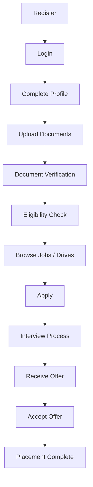
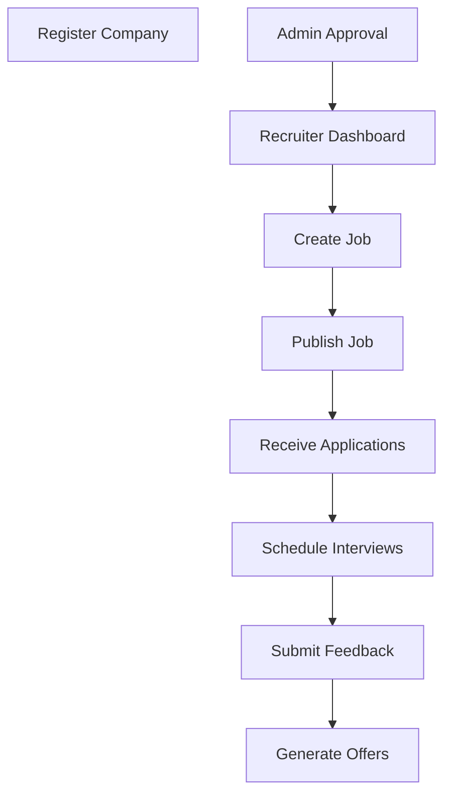
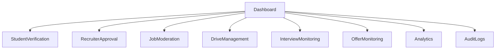
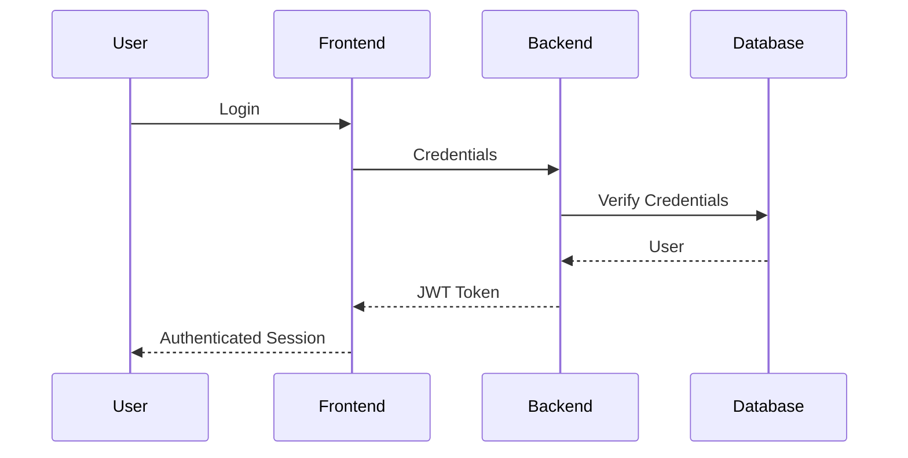
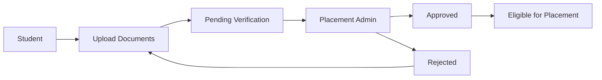
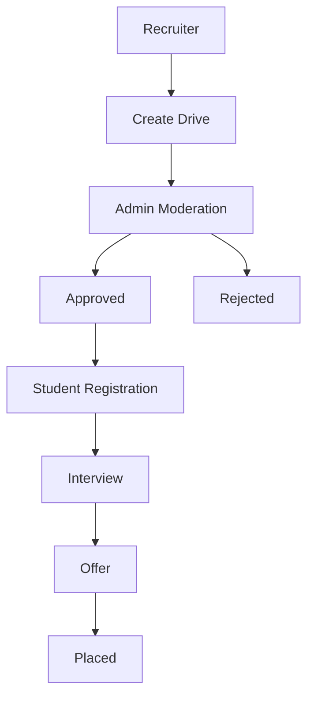
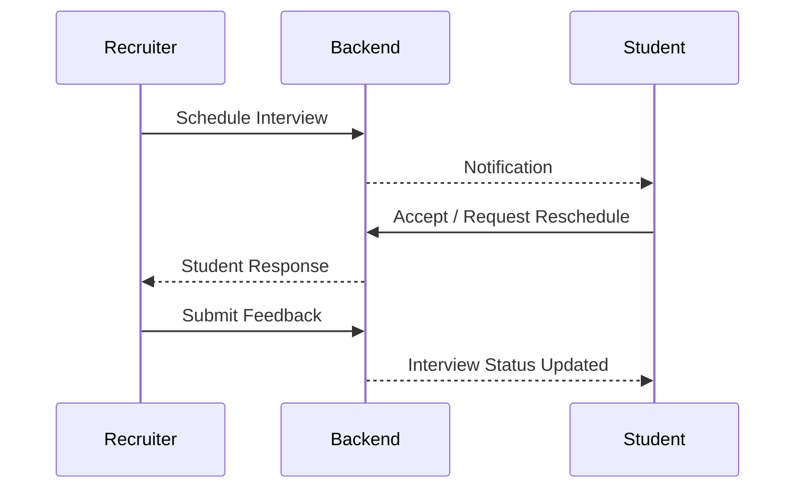
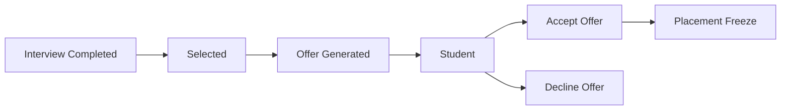
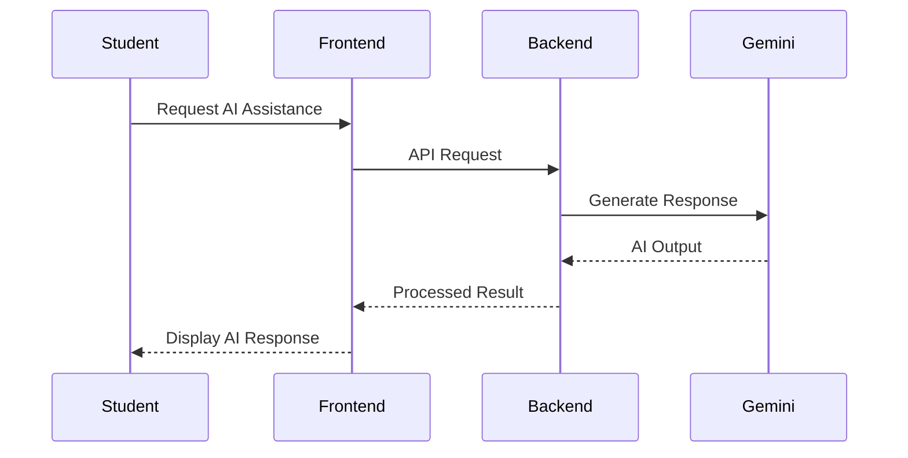
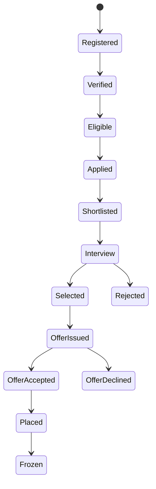

# PlacementHub System Design

> Business Workflows, Module Interactions, and Runtime Behavior

---

## Document Information

| Field | Value |
|--------|-------|
| Document Name | System Design |
| Project | PlacementHub |
| Version | 1.0.0 |
| Status | Draft |
| Owner | Anand Sagar |
| Parent Document | 00_PROJECT_DNA.md |
| Depends On | 01_ARCHITECTURE.md |
| Last Updated | 2026-08-03 |

---

## Purpose

This document describes how PlacementHub operates from a business and runtime perspective.

It documents user journeys, module interactions, business workflows, sequence diagrams, and system behavior.

This document complements the Architecture document by explaining how the architectural components collaborate to implement business functionality.

# Table of Contents

1. System Overview
2. Business Domains
3. User Journey Overview
4. Authentication Workflow
5. Student Workflow
6. Recruiter Workflow
7. Placement Administrator Workflow
8. AI Workflow
9. Notification Workflow
10. Document Verification Workflow
11. Campus Drive Workflow
12. Interview Workflow
13. Offer Workflow
14. Placement Lifecycle
15. State Transitions
16. Failure Scenarios
17. Future Enhancements

---

# System Overview

PlacementHub operates as a centralized placement management platform where Students, Recruiters, and Placement Administrators collaborate through a unified workflow.

Every business operation is executed through authenticated API requests processed by the backend, validated against business rules, and persisted in MongoDB.

External cloud services such as Cloudinary and Google Gemini extend the platform without becoming part of the core business logic.

---

# Business Domains

The platform is organized into the following business domains:

- Identity & Authentication
- User Management
- Profile Management
- Document Management
- Job Management
- Applications
- Campus Drives
- Interviews
- Offers
- Notifications
- Calendar & Events
- AI Services
- Administration
- Reporting & Analytics

---

# User Journey Overview

PlacementHub supports three primary user journeys.

- Student Journey
- Recruiter Journey
- Placement Administrator Journey

These journeys represent the complete business lifecycle supported by the platform.

---

# Student Workflow

The following workflow represents the complete placement lifecycle from a student's perspective.

---

# Recruiter Workflow

Recruiters interact with PlacementHub through an approval-based workflow.

---

# Placement Administrator Workflow

Placement administrators supervise and govern the complete placement ecosystem.

---

# Authentication Workflow

---

# Document Verification Workflow

Student-submitted documents are reviewed by Placement Administrators before they become eligible for placement activities.

---

# Campus Drive Workflow

---

# Interview Workflow

---

# Offer Workflow

---

# AI Workflow

---

# Notification Workflow

PlacementHub generates notifications for significant business events.

Examples include:

- Student verification updates
- Recruiter approval decisions
- Job application updates
- Campus drive registrations
- Interview schedules
- Offer generation
- Offer acceptance
- Placement status changes
- Administrative announcements

---

# Placement Lifecycle

---

# Failure Scenarios

Representative business failure scenarios include:

- Invalid authentication credentials
- Incomplete student profile
- Missing mandatory documents
- Student not meeting eligibility criteria
- Recruiter pending approval
- Campus drive registration deadline exceeded
- Interview declined or missed
- Offer declined by student
- AI service temporarily unavailable

The platform should fail gracefully while preserving system integrity and user data.

---

# Future Enhancements

The current system design supports future enhancements including:

- Multi-college support
- Multi-campus placement management
- Advanced workflow automation
- Email notification service
- Public APIs
- Mobile applications
- AI-powered analytics
- Background job processing

