# PlacementHub System Design

> Business Workflows, Module Interactions, and Runtime Behavior

---

## Document Information

| Field | Value |
|--------|-------|
| Document Name | System Design |
| Project | PlacementHub |
| Version | 1.0.0 |
| Status | Draft |
| Owner | Anand Sagar |
| Parent Document | 00_PROJECT_DNA.md |
| Depends On | 01_ARCHITECTURE.md |
| Last Updated | 2026-08-03 |

---

## Purpose

This document describes how PlacementHub operates from a business and runtime perspective.

It documents user journeys, module interactions, business workflows, sequence diagrams, and system behavior.

This document complements the Architecture document by explaining how the architectural components collaborate to implement business functionality.

# Table of Contents

1. System Overview
2. Runtime Architecture
3. Request Lifecycle
4. Business Domains
5. User Journey Overview
6. Authentication Workflow
7. Student Workflow
8. Recruiter Workflow
9. Placement Administrator Workflow
10. Profile Completion Workflow
11. Document Verification Workflow
12. Job Lifecycle
13. Application Lifecycle
14. Campus Drive Workflow
15. Interview Workflow
16. Offer Workflow
17. Placement Policy Workflow
18. Notification Workflow
19. AI Workflow
20. Calendar Workflow
21. Dashboard Data Flow
22. Placement Lifecycle
23. Failure Scenarios
24. Performance Considerations
25. Future Enhancements
---

# System Overview

PlacementHub operates as a centralized placement management platform where Students, Recruiters, and Placement Administrators collaborate through a unified workflow.

Every business operation is executed through authenticated API requests processed by the backend, validated against business rules, and persisted in MongoDB.

External cloud services such as Cloudinary and Google Gemini extend the platform without becoming part of the core business logic.

---

---

# Runtime Architecture

PlacementHub follows a request-driven architecture where every business operation is executed through a sequence of coordinated interactions between the user interface, backend services, database, and optional external cloud services.

The frontend is responsible for user interaction, input validation, and presentation logic. All business rules, authorization checks, workflow validation, and state transitions are enforced by the backend.

Persistent business data is stored within MongoDB, while specialized external services are integrated only where necessary. Cloudinary provides secure media storage for user-uploaded documents, and Google Gemini delivers AI-powered assistance without becoming a dependency for the platform's core business workflows.

The runtime architecture is designed around the following principles:

- Stateless backend request processing.
- Centralized business rule enforcement.
- Role-based authorization.
- API-first communication.
- Modular business workflows.
- Independent external service integration.
- Persistent auditability of administrative operations.
- Scalable request handling through asynchronous backend processing.

Every business transaction follows the same high-level execution path regardless of user role.

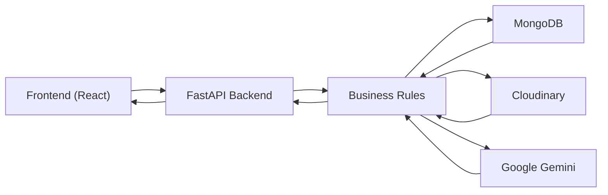

---

# Request Lifecycle

Every request processed by PlacementHub follows a standardized execution pipeline.

The backend validates authentication before performing authorization checks. Once the requesting user's permissions have been verified, the corresponding business rules are evaluated. If validation succeeds, the required database operations are executed, optional external services are invoked when necessary, audit records are generated for privileged actions, notifications are created when applicable, and the final response is returned to the client.

This consistent processing pipeline ensures predictable system behavior, centralized security enforcement, and maintainable business logic.

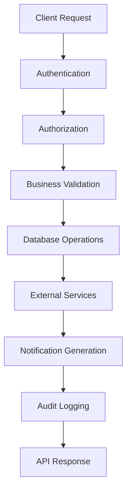

# Business Domains

The platform is organized into the following business domains:

- Identity & Authentication
- User Management
- Profile Management
- Document Management
- Job Management
- Applications
- Campus Drives
- Interviews
- Offers
- Notifications
- Calendar & Events
- AI Services
- Administration
- Reporting & Analytics

---

# User Journey Overview

PlacementHub supports three primary user journeys.

- Student Journey
- Recruiter Journey
- Placement Administrator Journey

These journeys represent the complete business lifecycle supported by the platform.

---

# Student Workflow

The following workflow represents the complete placement lifecycle from a student's perspective.

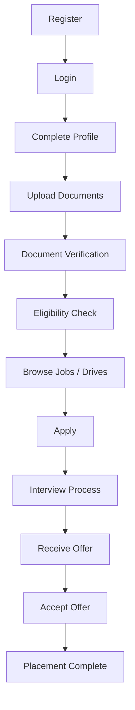

---

# Recruiter Workflow

Recruiters interact with PlacementHub through an approval-based workflow.

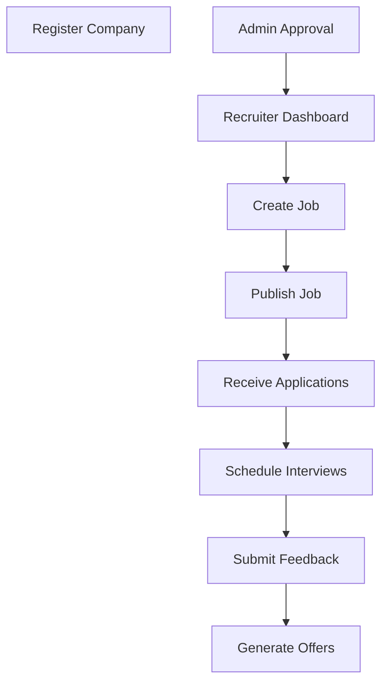
---

# Placement Administrator Workflow

Placement administrators supervise and govern the complete placement ecosystem.

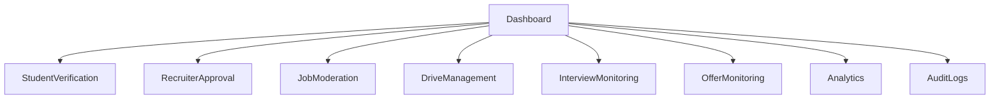

---

# Profile Completion Workflow

A student's placement journey begins with profile completion immediately after successful registration.

The platform continuously evaluates profile completeness whenever profile information or supporting documents are updated. A completion percentage is calculated based on mandatory academic, personal, and placement-related information.

Students cannot fully participate in placement activities until mandatory profile requirements have been satisfied.

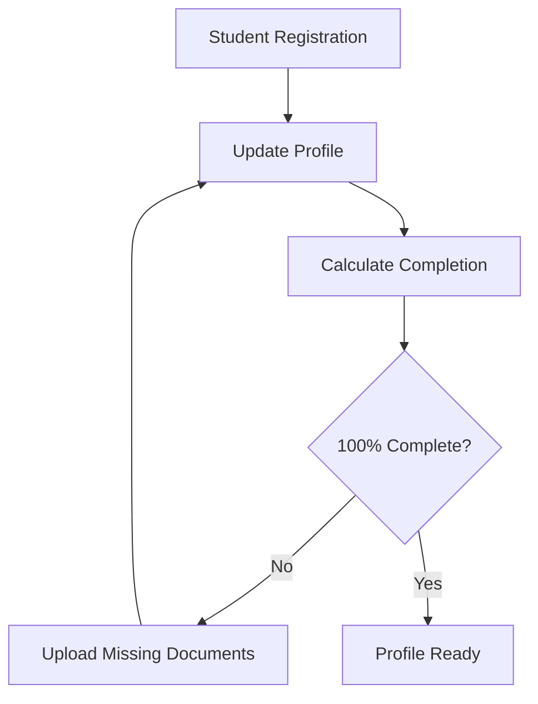

### Business Rules

- Profile completion is recalculated after every profile update.
- Missing required information reduces completion percentage.
- Completion status is stored with the student profile.
- Dashboard widgets always display the latest completion progress.

# Authentication Workflow

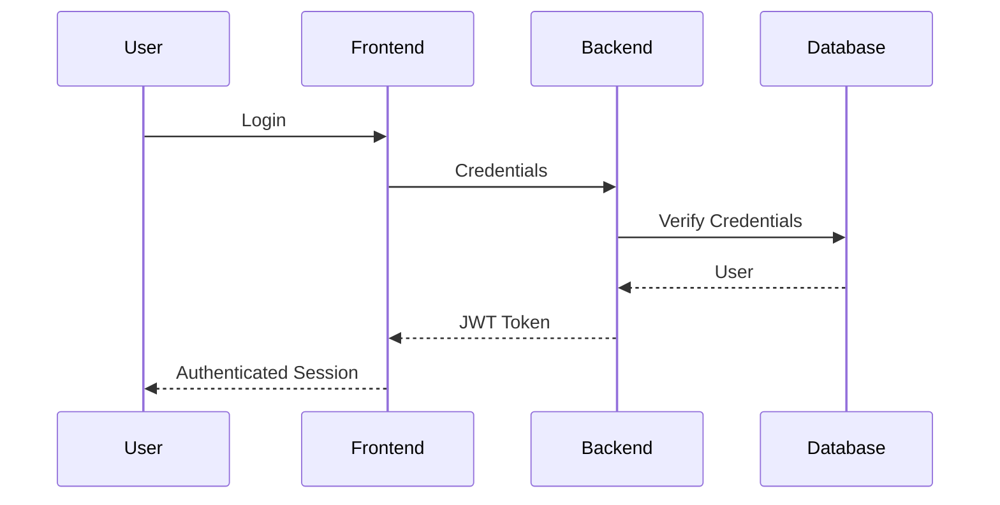

---

# Document Verification Workflow

Student-submitted documents are reviewed by Placement Administrators before they become eligible for placement activities.

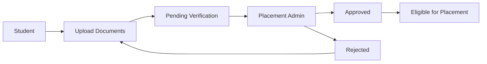

---

# Job Lifecycle

Every placement opportunity progresses through a controlled lifecycle managed by recruiters and administrators.

Recruiters create placement opportunities, define eligibility criteria, and publish jobs after satisfying organizational approval requirements.

Students interact only with jobs that are visible, active, and satisfy institutional placement policies.

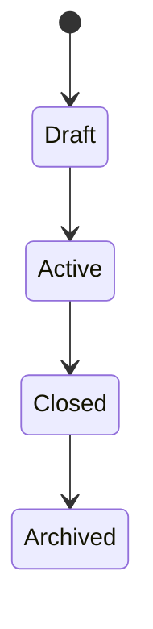

### Business Rules

- Only approved recruiters can create jobs.
- Jobs must contain eligibility requirements before publication.
- Archived jobs remain available for reporting but are no longer visible to students.
- Closed jobs stop accepting new applications while preserving historical records.

---

# Application Lifecycle

Student applications progress through multiple recruitment stages until a hiring decision is reached.

Every transition is recorded to maintain a complete recruitment timeline.

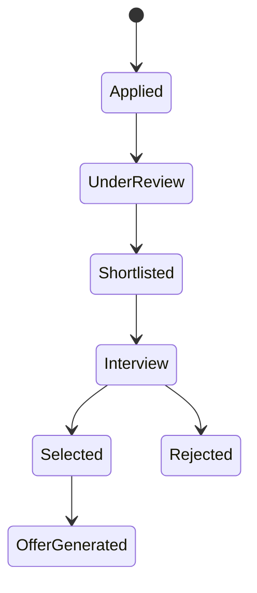

### Business Rules

- Duplicate applications are not permitted.
- Eligibility validation occurs before application creation.
- Recruiters control application progression.
- Status changes generate notifications for affected students.

---

# Campus Drive Workflow

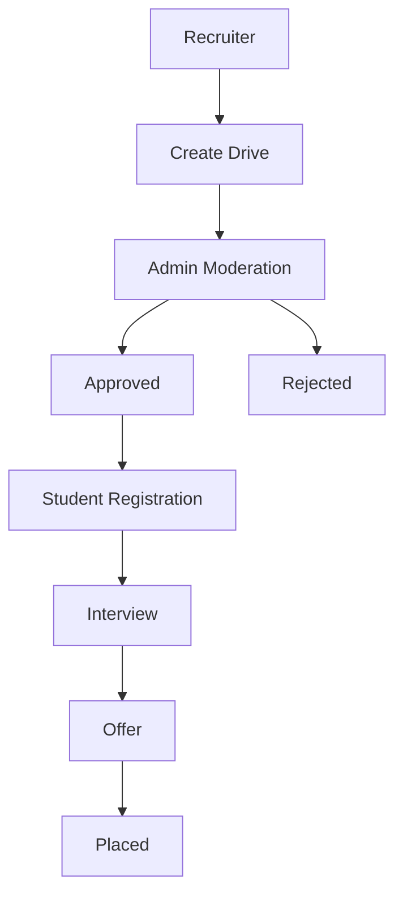

---

# Interview Workflow

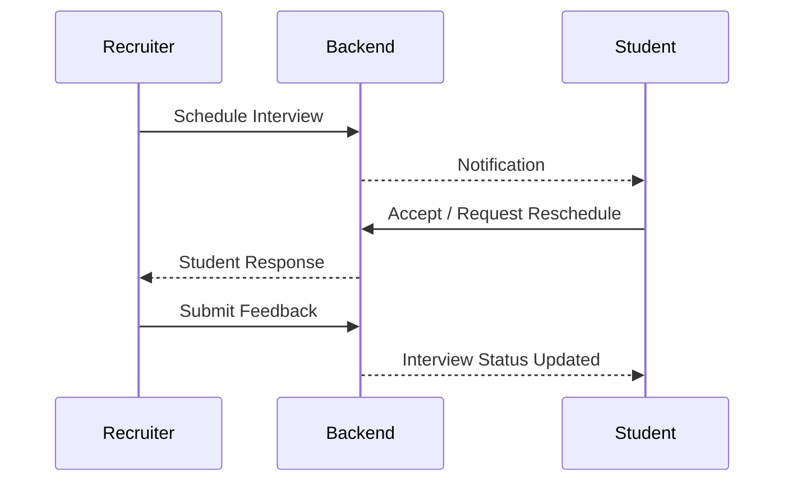

---

# Offer Workflow

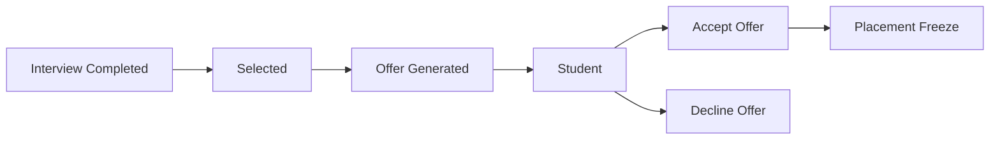
---

# Placement Policy Workflow

PlacementHub enforces institutional placement policies after a student receives an offer.

Once an offer has been accepted, the platform automatically updates placement status, freezes further participation when required, and preserves historical recruitment records.

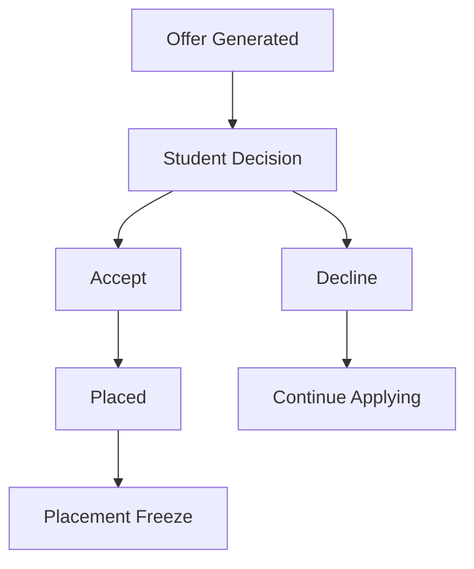

### Business Rules

- Accepted offers update placement status.
- Placement freeze prevents additional applications unless institutional policy allows exceptions.
- Declined offers preserve recruitment history without freezing the student.

---

# AI Workflow

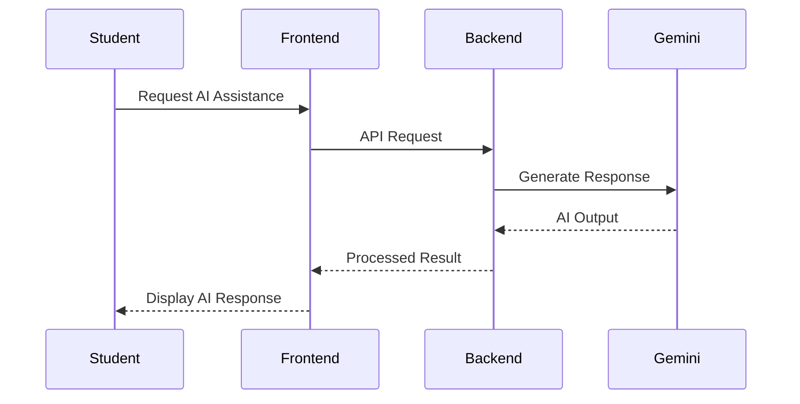
---

# Calendar Workflow

PlacementHub aggregates scheduling information from multiple business modules into a unified calendar experience.

Students, recruiters, and administrators each receive calendar entries relevant to their responsibilities.

Calendar entries may include:

- Campus Drives
- Interviews
- Registration Deadlines
- Placement Events
- Administrative Activities

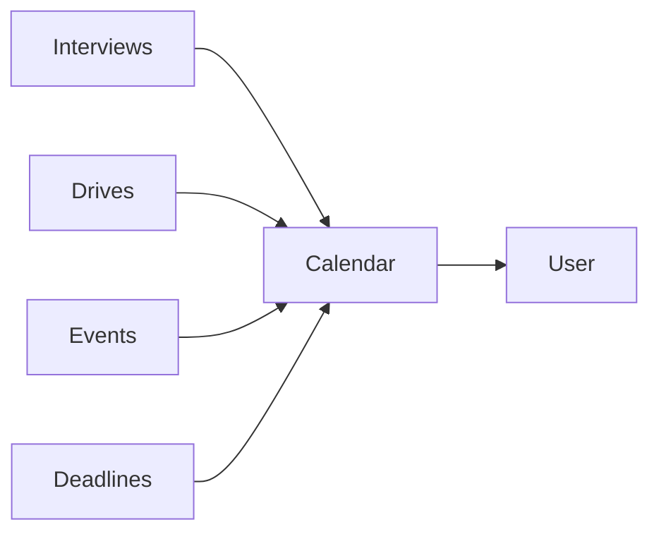

---

# Notification Workflow

PlacementHub generates notifications for significant business events.

Examples include:

- Student verification updates
- Recruiter approval decisions
- Job application updates
- Campus drive registrations
- Interview schedules
- Offer generation
- Offer acceptance
- Placement status changes
- Administrative announcements

---

# Dashboard Data Flow

Dashboard information is generated dynamically by aggregating operational data from multiple business modules.

Rather than storing dashboard statistics independently, PlacementHub derives analytics directly from current business data to ensure consistency across the platform.

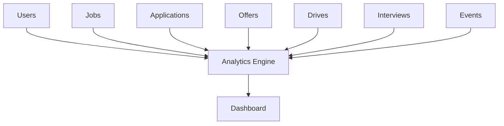

The resulting dashboards provide role-specific operational insights while maintaining consistency with the underlying business data.

---

# Placement Lifecycle

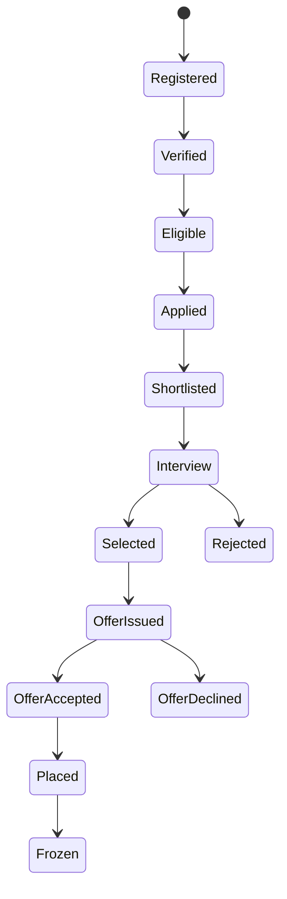
---

# Failure Scenarios

Representative business failure scenarios include:

- Invalid authentication credentials
- Incomplete student profile
- Missing mandatory documents
- Student not meeting eligibility criteria
- Recruiter pending approval
- Campus drive registration deadline exceeded
- Interview declined or missed
- Offer declined by student
- AI service temporarily unavailable

The platform should fail gracefully while preserving system integrity and user data.

---

# Performance Considerations

PlacementHub is designed to provide responsive user experiences while maintaining data consistency across all business workflows.

The system emphasizes efficient request processing through asynchronous backend execution and optimized database access patterns.

Current performance considerations include:

- Asynchronous API request handling using FastAPI.
- Stateless backend request processing.
- Indexed database queries for frequently accessed collections.
- Role-specific API responses to minimize unnecessary payload size.
- Cloudinary-based media delivery for document assets.
- Server-side eligibility evaluation.
- Aggregated dashboard statistics generated on demand.
- Efficient notification retrieval with read-status tracking.

Future optimizations may include:

- Redis caching
- Background task processing
- Database aggregation optimization
- Response compression
- CDN integration
- Horizontal backend scaling

---

# Failure Handling Strategy

PlacementHub follows a fail-safe execution model in which business operations either complete successfully or terminate without leaving the platform in an inconsistent state.

Whenever a business rule cannot be satisfied, the backend immediately terminates request processing and returns an appropriate error response.

Failure handling principles include:

- Authentication validation before authorization.
- Authorization before business validation.
- Input validation before database modification.
- Database consistency before external service invocation.
- Graceful handling of optional AI service failures.
- Comprehensive audit logging for privileged administrative actions.
- Consistent HTTP error responses.

The platform is designed to preserve business integrity even when external services become temporarily unavailable.

---

# Related Documentation

The following documents provide implementation details complementary to this System Design specification.

| Document | Purpose |
|----------|---------|
| 00_PROJECT_DNA.md | Engineering principles, vision, and project governance |
| 01_ARCHITECTURE.md | High-level software architecture and infrastructure |
| 03_DATABASE_SCHEMA.md | Database collections, schemas, and relationships |
| 04_API_REFERENCE.md | Complete REST API specification |

# Future Enhancements

The current system design supports future enhancements including:

- Multi-college support
- Multi-campus placement management
- Advanced workflow automation
- Email notification service
- Public APIs
- Mobile applications
- AI-powered analytics
- Background job processing

---

# Revision History

| Version | Date | Description |
|----------|------|-------------|
| 2.0.0 | 2026-08-03 | Initial enterprise system design created. |

---

# Design Validation Checklist

The current system design satisfies the following engineering objectives.

- Centralized authentication
- Role-Based Access Control (RBAC)
- Modular business workflows
- Stateless backend architecture
- Enterprise placement lifecycle
- AI-assisted functionality
- Secure document management
- Recruiter approval workflow
- Placement policy enforcement
- Audit logging
- Notification framework
- Campus drive management
- Interview lifecycle management
- Offer lifecycle management
- Scalable runtime architecture