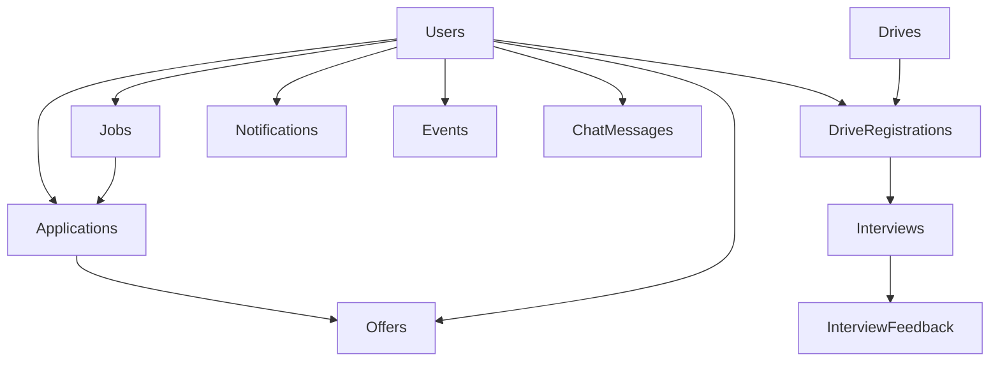

# PlacementHub Database Schema

> Complete Database Design and Data Model Documentation

---

## Document Information

| Field | Value |
|--------|-------|
| Document Name | Database Schema |
| Project | PlacementHub |
| Version | 2.0.0 |
| Status | Draft |
| Owner | Anand Sagar |
| Parent Document | 00_PROJECT_DNA.md |
| Depends On | 01_ARCHITECTURE.md |
| Last Updated | 2026-08-03 |

---

## Purpose

This document defines the logical and physical data model of PlacementHub.

It describes database collections, document structures, relationships, constraints, indexes, validation rules, and data ownership.

This document serves as the authoritative reference for database design.

# Table of Contents

1. Database Overview
2. Database Technology
3. Design Principles
4. Collection Overview
5. Collection Schemas
6. Relationships
7. Indexing Strategy
8. Data Validation
9. Data Lifecycle
10. Security Considerations
11. Backup & Recovery
12. Future Evolution

# Database Overview

PlacementHub uses MongoDB Atlas as its primary operational database.

The platform follows a document-oriented architecture where each collection represents a distinct business capability.

Rather than storing data in highly normalized relational tables, PlacementHub groups related information into cohesive MongoDB documents while maintaining logical relationships through UUID-based references.

The current implementation consists of fourteen primary collections supporting authentication, placement operations, campus drives, interviews, AI services, notifications, analytics, and administrative workflows.
---

---

# Database Technology

| Property | Value |
|----------|-------|
| Database | MongoDB Atlas |
| Database Model | Document Database |
| Driver | Motor (Async MongoDB Driver) |
| Backend Framework | FastAPI |
| Object Identifiers | UUID (String) |
| Data Format | BSON Documents |
| Query Style | Asynchronous CRUD Operations |
---

---

# Database Design Principles

PlacementHub follows the following database design principles.

- Business-domain driven collection organization.
- UUID-based identifiers for portability.
- Document embedding for tightly coupled data.
- References for independent business entities.
- Minimized document duplication.
- Flexible schema evolution.
- Optimized read-heavy placement workflows.
- Security-sensitive fields isolated where appropriate.

---

# Collection Overview

| Collection | Responsibility |
|------------|----------------|
| users | Students, Recruiters, Administrators, Staff Accounts |
| jobs | Job Opportunities |
| applications | Student Job Applications |
| offers | Placement Offers |
| notifications | In-App Notification Center |
| audit_logs | Administrative Audit Trail |
| security_logs | Security Events |
| password_reset_otps | Password Reset Workflow |
| drives | Campus Drives |
| drive_registrations | Campus Drive Registrations |
| interviews | Interview Scheduling |
| interview_feedback | Interview Evaluation |
| events | Placement Events |
| chat_messages | AI Assistant Conversation History |

---

# Logical Data Model

---

# Collection Specifications

This section documents every MongoDB collection implemented within PlacementHub.

Each collection specification includes:

- Purpose
- Document Structure
- Field Dictionary
- Relationships
- Embedded Documents
- Business Rules
- Index Recommendations

---

# Users Collection

## Purpose

The `users` collection is the central identity store of PlacementHub.

It manages authentication, authorization, profile information, role management, placement status, verification workflows, recruiter approval, administrator accounts, and user-specific platform data.

Rather than maintaining separate collections for Students, Recruiters, and Administrators, PlacementHub stores all user types within a single polymorphic collection differentiated by the `role` field.

### Common Fields

The following fields exist for every user document regardless of role.

| Field | Type | Required | Description |
|--------|------|----------|-------------|
| id | UUID String | Yes | Primary business identifier |
| name | String | Yes | Full name |
| email | String | Yes | Unique email address |
| password_hash | String | Yes | Encrypted password |
| role | Enum | Yes | student, company, admin |
| created_at | ISO DateTime | Yes | Account creation timestamp |
| profile_complete | Boolean | Yes | Profile completion status |

### Student-Specific Fields

The following fields are applicable only when `role = student`.

| Field |
|-------|
| branch |
| department |
| skills |
| projects |
| certificates |
| backlogs |
| documents |
| verification_status |
| verification_remarks |
| verification_date |
| verified_by |
| frozen |
| freeze_reason |
| placed |
| placed_company |
| placed_package |
| profile_score |

### Company-Specific Fields

The following fields are applicable only when `role = company`.

| Field |
|-------|
| company_name |
| industry |
| website |
| approval_status |
| approval_remarks |
| verified |

### Administrator-Specific Fields

The following fields are applicable only when `role = admin`.

| Field |
|-------|
| admin_role |

### Embedded Objects

The Users collection embeds tightly coupled information directly inside user documents.

Current embedded structures include:

- Documents
- Profile Score
- Skills
- Projects
- Certificates

This design minimizes unnecessary collection joins while improving read performance for user-centric operations.

### Relationships

The Users collection participates in relationships with multiple business collections.

| Related Collection | Relationship |
|--------------------|--------------|
| jobs | Company creates jobs |
| applications | Student submits applications |
| offers | Student receives offers |
| notifications | User receives notifications |
| drives | Recruiter creates campus drives |
| drive_registrations | Student registers for drives |
| interviews | Student and recruiter participate |
| chat_messages | AI conversations |
| audit_logs | Administrator activities |

### Business Rules

Key business rules governing the Users collection include:

- Every email address must be unique.
- Passwords are stored only as secure hashes.
- Recruiters require administrative approval before accessing recruitment features.
- Students require profile completion and verification before participating in placement activities.
- Placement freeze restricts further applications according to placement policy.
- Administrative permissions are determined through role-specific access control.

### Recommended Indexes

| Field |
|-------|
| id |
| email |
| role |
| verification_status |
| approval_status |
| placed |
| frozen |

---

# Jobs Collection

## Purpose

The `jobs` collection stores recruitment opportunities published by approved recruiters.

It contains job descriptions, eligibility criteria, compensation details, application deadlines, publication status, and company ownership information.

### Relationships

- Created by Company Users
- Referenced by Applications
- Referenced by Offers
- Used by Eligibility Engine

---

# Applications Collection

## Purpose

The `applications` collection records every student job application submitted through the platform.

It maintains the complete application lifecycle from submission through selection.

### Relationships

- References Users
- References Jobs
- References Offers

### Business Rules

- One student can submit only one application per job.
- Eligibility validation is performed before application creation.
- Every status transition is recorded in the application timeline.

---

# Offers Collection

## Purpose

The `offers` collection manages placement offers generated after successful recruitment.

It tracks offer status, acceptance, rejection, and placement policy enforcement.

### Relationships

- References Applications
- References Students
- References Companies

### Business Rules

- Offer acceptance may trigger placement freeze.
- Previous offers may be automatically declined according to placement policy.

---

# Notifications Collection

## Purpose

Stores user-specific in-app notifications generated by business events throughout the platform.

Notifications support verification updates, interview schedules, offers, approvals, reminders, and administrative announcements.

---

# Audit Logs Collection

## Purpose

Stores immutable records of privileged administrative actions.

The audit trail supports governance, accountability, troubleshooting, and security investigations.

---

# Security Logs Collection

## Purpose

Stores security-related events including authentication failures, password reset requests, suspicious activity, and other security operations.

This collection supports monitoring and incident investigation.

---

# Password Reset OTPs Collection

## Purpose

Supports the secure password recovery workflow.

Temporary OTP records are created, validated, expired, and invalidated during password reset operations.

### Business Rules

- OTPs have limited validity.
- Maximum verification attempts are enforced.
- Previously issued OTPs become invalid after successful password reset.

---

# Campus Drives Collection

## Purpose

Stores recruiter-created campus recruitment drives.

Each drive maintains registration periods, eligibility constraints, moderation status, capacity limits, and operational lifecycle.

---

# Drive Registrations Collection

## Purpose

Maintains student participation records for campus drives.

Each registration progresses through multiple recruitment stages until placement completion.

---

# Interviews Collection

## Purpose

Stores interview schedules, interview modes, participant information, interview status, student responses, and operational metadata.

---

# Interview Feedback Collection

## Purpose

Stores structured recruiter evaluations for completed interviews.

Feedback includes technical assessment, communication, recommendations, ratings, and hiring decisions.

---

# Events Collection

## Purpose

Stores placement-related events displayed within the institutional placement calendar.

---

# Chat Messages Collection

## Purpose

Stores persistent AI conversation history for authenticated users.

Conversation history enables contextual AI assistance across multiple sessions.

---

# Data Relationships

PlacementHub primarily uses UUID-based logical references between collections.

Relationship categories include:

- User → Jobs
- User → Applications
- User → Offers
- User → Notifications
- User → Drives
- User → Interviews
- Job → Applications
- Application → Offers
- Drive → Registrations
- Registration → Interviews
- Interview → Feedback

MongoDB document embedding is used only where data is tightly coupled to a parent document.

---

# Index Strategy

Frequently queried fields should be indexed to optimize read performance.

Recommended index categories include:

- Primary Identifiers
- Email Addresses
- User Roles
- Verification Status
- Approval Status
- Job Status
- Application Status
- Interview Status
- Drive Status
- Notification Ownership
- Event Dates

---

# Data Lifecycle

Business data progresses through well-defined lifecycle stages.

General lifecycle pattern:

Creation → Validation → Active Usage → Historical Reference → Archival (Future)

Operational records should remain traceable throughout their lifecycle to preserve auditability and reporting accuracy.

---

# Future Database Evolution

Future database improvements may include:

- Collection-level schema validation
- Automated archival policies
- Read replicas
- Sharding for horizontal scaling
- Background data cleanup
- Advanced indexing strategies
- Database observability
- Backup automation

