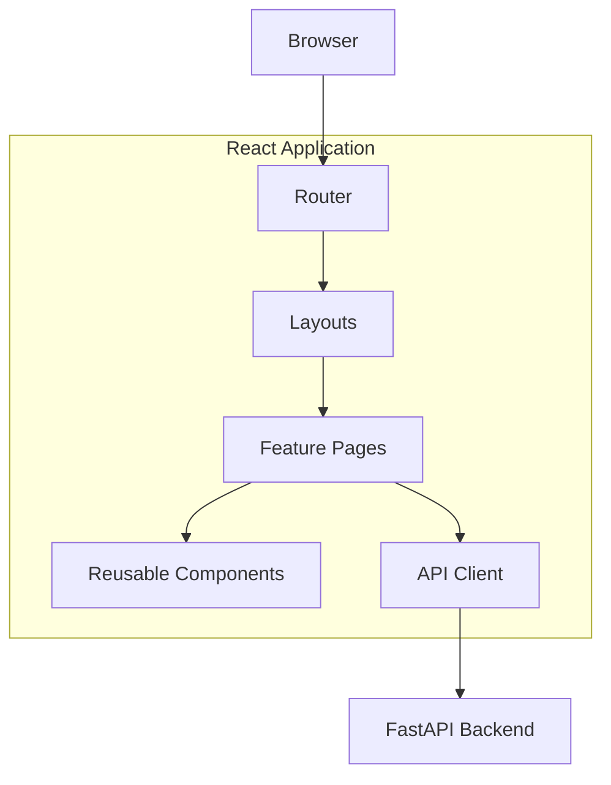
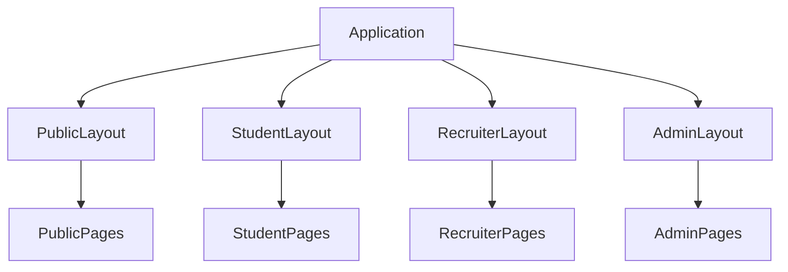
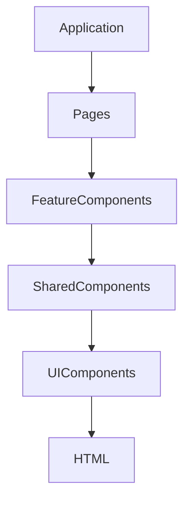
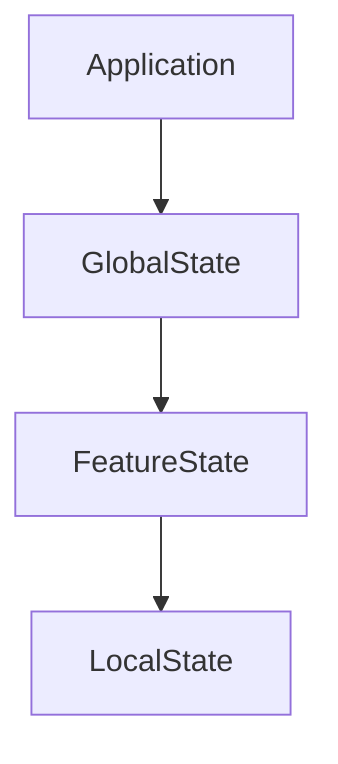
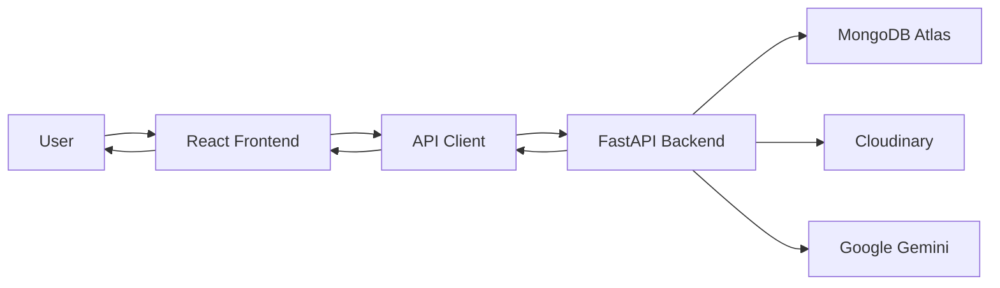
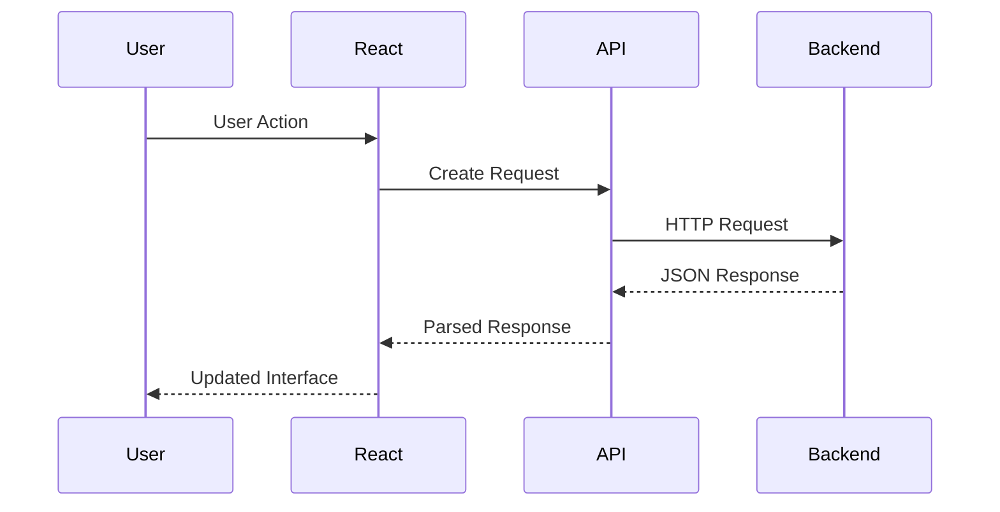
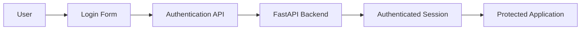
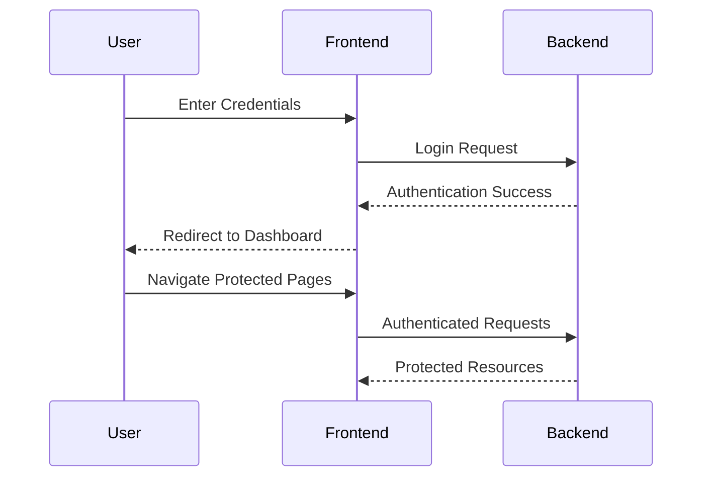
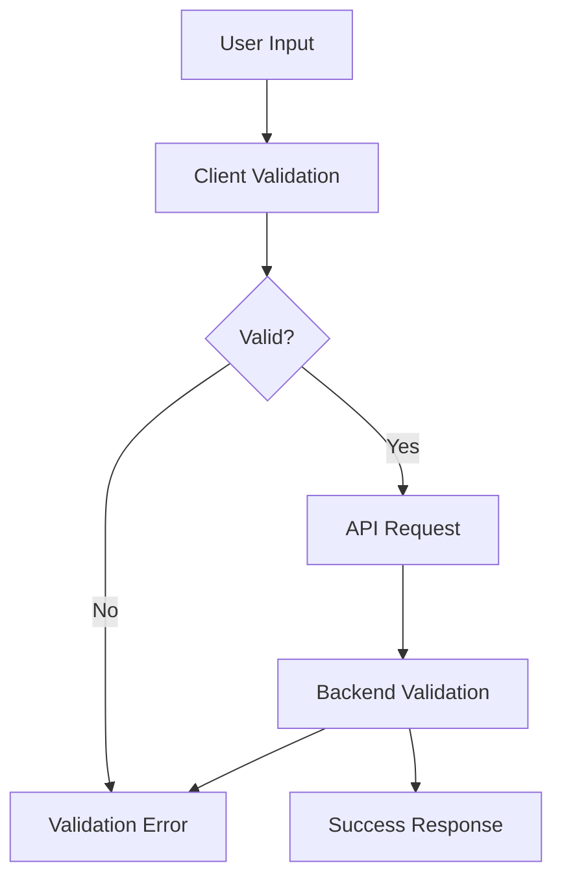

# PlacementHub Frontend Guide

> Frontend Engineering Standards and Development Guide

---

## Document Information

| Field | Value |
|--------|-------|
| Document Name | Frontend Guide |
| Project | PlacementHub |
| Version | 1.0.0 |
| Status | Draft |
| Owner | Anand Sagar |
| Scope | Frontend Application |
| Parent Document | 00_PROJECT_DNA.md |
| Depends On | 01_ARCHITECTURE.md |
| Last Updated | 2026-08-03 |

---

## Purpose

This document defines the frontend engineering standards, architecture, development practices, and implementation guidelines for the PlacementHub React application.

It serves as the primary reference for frontend development and should be used alongside the Project DNA and Architecture documents.

---

## Audience

This document is intended for:

- Frontend Developers
- Full-Stack Developers
- Technical Reviewers
- Future Contributors
- AI Coding Assistants

---

## Scope

This guide covers the frontend application's architecture, component organization, routing, state management, API communication, styling conventions, performance practices, and development standards.

Business workflows, backend implementation, database design, and API specifications are documented separately.

---

# Frontend Overview

The PlacementHub frontend is a React-based Single Page Application (SPA) that provides role-specific user experiences for Students, Recruiters, and Placement Administrators.

It is responsible for presenting business information, collecting user input, managing client-side navigation, communicating with backend APIs, and rendering interactive dashboards.

The frontend contains no business-critical decision-making logic. All authorization checks, workflow validation, eligibility evaluation, and business rules are enforced by the backend.

The application is designed around reusable components, modular page organization, and centralized API communication to ensure maintainability, scalability, and consistent user experience.

Primary frontend responsibilities include:

- User Interface Rendering
- Client-side Navigation
- Authentication State Management
- Secure API Communication
- Form Handling and Validation
- Dashboard Visualization
- Notification Presentation
- Responsive User Experience
- File Upload Integration
- AI Feature Integration

---

# Technology Stack

The frontend is implemented using a modern React ecosystem selected for maintainability, developer productivity, and long-term scalability.

| Category | Technology | Purpose |
|----------|------------|---------|
| Framework | React 19 | Component-based user interface |
| Language | JavaScript (Current) | Frontend application development |
| Routing | React Router | Client-side routing |
| Styling | Tailwind CSS | Utility-first styling |
| UI Components | Shadcn UI | Reusable interface components |
| HTTP Client | Fetch API | Backend communication |
| Icons | Lucide React | Icon library |
| Notifications | Sonner | Toast notifications |
| Deployment | Vercel | Frontend hosting |

---

# Frontend Architecture

The frontend follows a modular component-based architecture.

Responsibilities are separated across routing, layouts, reusable UI components, feature pages, API communication, and shared utilities.

Business logic remains minimal within the frontend, while workflow validation and authorization are delegated to the backend.



---

# Project Structure

The frontend follows a feature-oriented directory organization where application logic, reusable components, pages, and shared utilities are separated into dedicated modules.

The current frontend structure is organized as follows:

```text
frontend/
│
├── public/
│
├── plugins/
│   └── health-check/
│
├── src/
│   ├── assets/
│   │   └── images/
│   │
│   ├── components/
│   │   └── ui/
│   │
│   ├── constants/
│   │   └── testIds/
│   │
│   ├── context/
│   │
│   ├── hooks/
│   │
│   ├── lib/
│   │
│   └── pages/
│       ├── admin/
│       ├── company/
│       └── student/
│
├── package.json
├── tailwind.config.js
├── postcss.config.js
├── components.json
└── craco.config.js
```

The directory structure emphasizes separation between reusable UI components, feature pages, application state, shared utilities, and static assets.

Development dependencies located inside `node_modules/` are intentionally omitted from architectural documentation because they are generated artifacts rather than source code.

---

# Directory Responsibilities

Each directory within the frontend has a clearly defined responsibility. Maintaining these boundaries improves maintainability, scalability, and developer productivity.

| Directory | Responsibility |
|------------|----------------|
| `public/` | Static assets served directly by the web server without processing. |
| `plugins/` | Optional frontend extensions, utilities, or integration modules that remain isolated from the core application. |
| `src/assets/` | Images, icons, logos, illustrations, fonts, and other static resources imported by React components. |
| `src/components/` | Reusable UI components shared across multiple pages and features. |
| `src/components/ui/` | Low-level design system components such as buttons, dialogs, inputs, tables, cards, badges, dropdowns, and layout primitives. |
| `src/constants/` | Application-wide constant values, enums, route names, configuration values, and reusable identifiers. |
| `src/context/` | React Context providers responsible for application-wide state management such as authentication and user session data. |
| `src/hooks/` | Custom React hooks that encapsulate reusable business logic and stateful behavior. |
| `src/lib/` | Shared helper functions, API client configuration, utility modules, formatters, validators, and common infrastructure code. |
| `src/pages/` | Route-level page components representing complete application screens. |
| `src/pages/student/` | Student-facing dashboards and placement functionality. |
| `src/pages/company/` | Recruiter-facing dashboards, job management, and hiring workflows. |
| `src/pages/admin/` | Placement administrator dashboards, moderation tools, analytics, and system management interfaces. |

---

## Directory Ownership Principles

The frontend follows strict ownership rules to minimize coupling between modules.

### Components

- Must remain reusable.
- Must not contain business-specific API logic.
- Should receive data through props or hooks.

### Pages

- Represent complete application screens.
- Coordinate business workflows.
- Compose reusable components.
- Invoke API services when required.

### Hooks

- Encapsulate reusable stateful logic.
- May perform API communication.
- Must not directly render UI.

### Context

- Stores global application state.
- Provides authenticated user information.
- Coordinates shared application behavior.

### Lib

- Contains pure utility functions.
- Should remain framework-independent whenever practical.
- May include API wrappers, helper methods, validators, and formatting utilities.

### Assets

- Stores static media resources.
- Must not contain executable application logic.

These ownership boundaries reduce duplication and make future feature development significantly easier.

---

# Frontend Technology Stack

PlacementHub's frontend is built on a modern React ecosystem selected for maintainability, scalability, performance, and long-term developer productivity.

Each technology has a clearly defined architectural responsibility.

| Layer | Technology | Responsibility |
|--------|------------|----------------|
| Framework | React | Component-based user interface development |
| Language | JavaScript (Current Implementation) | Frontend application logic |
| Routing | React Router | Client-side navigation |
| Styling | Tailwind CSS | Utility-first styling framework |
| UI Library | Shadcn UI | Reusable UI components |
| Icons | Lucide React | Consistent icon system |
| HTTP Client | Fetch API | Communication with backend APIs |
| Notifications | Sonner | Toast notifications |
| Build Tool | CRACO | Build configuration customization |
| Deployment | Vercel | Frontend hosting |

The selected technologies prioritize simplicity, modularity, and long-term maintainability while remaining compatible with future architectural evolution.

---

# Frontend Dependency Architecture

The frontend ecosystem is organized into multiple dependency categories.

## Core Dependencies

Core dependencies provide the primary application framework.

Examples include:

- React
- React DOM
- React Router

These dependencies define the application's rendering lifecycle and navigation model.

---

## UI Dependencies

UI dependencies provide reusable interface components and visual consistency.

Examples include:

- Shadcn UI
- Lucide React
- Tailwind CSS

These libraries should remain presentation-focused and must not contain business logic.

---

## Infrastructure Dependencies

Infrastructure libraries support communication and application behavior.

Examples include:

- Fetch API
- Authentication utilities
- Environment configuration
- Notification services

Infrastructure components should remain isolated from presentation components whenever practical.

---

## Development Dependencies

Development dependencies assist during local development and build processes.

Examples include:

- CRACO
- PostCSS
- Tailwind CLI
- ESLint (future)
- Prettier (future)

Development dependencies should never become runtime dependencies for production users.

---

# Routing Strategy

PlacementHub follows a centralized client-side routing architecture built on React Router.

Application routes are organized according to user roles and business capabilities rather than implementation details. Each route represents a complete user workflow and is protected according to authentication and authorization requirements.

The routing architecture emphasizes:

- Predictable URL structure
- Role-based navigation
- Protected application routes
- Separation between public and authenticated pages
- Centralized route management
- Future scalability

---

## Route Categories

The application is divided into multiple routing domains.

| Route Category | Purpose |
|----------------|---------|
| Public Routes | Accessible without authentication (Landing Page, Login, Registration, Forgot Password, etc.) |
| Student Routes | Placement workflows available only to authenticated students |
| Recruiter Routes | Company recruitment management and hiring workflows |
| Administrator Routes | Platform administration, verification, moderation, analytics, and governance |
| Shared Routes | Features accessible by multiple authenticated roles (Profile, Notifications, Settings, etc.) |
| Error Routes | Not Found, Unauthorized, and application error pages |

---

## Route Hierarchy

```text
/

├── Public
│   ├── /
│   ├── /login
│   ├── /register
│   ├── /forgot-password
│   └── /reset-password
│
├── Student
│   ├── /student/dashboard
│   ├── /student/profile
│   ├── /student/jobs
│   ├── /student/applications
│   ├── /student/drives
│   ├── /student/interviews
│   ├── /student/offers
│   └── /student/settings
│
├── Company
│   ├── /company/dashboard
│   ├── /company/jobs
│   ├── /company/applications
│   ├── /company/drives
│   ├── /company/interviews
│   └── /company/settings
│
├── Admin
│   ├── /admin/dashboard
│   ├── /admin/students
│   ├── /admin/companies
│   ├── /admin/jobs
│   ├── /admin/drives
│   ├── /admin/interviews
│   ├── /admin/audit
│   ├── /admin/analytics
│   └── /admin/settings
│
└── Shared
    ├── /notifications
    ├── /profile
    └── /settings
```

---

## Route Protection

Every protected route requires backend-authenticated user identity before page access is granted.

The frontend is responsible only for improving user experience by preventing unnecessary navigation.

Actual authorization decisions are always enforced by the backend.

Route protection includes:

- Authentication validation
- Session validation
- Role verification
- Redirect handling
- Unauthorized page rendering
- Expired session recovery

The frontend should never rely solely on client-side authorization for application security.

---

## Navigation Principles

PlacementHub follows several navigation principles.

- Every user sees only role-relevant navigation.
- Navigation remains consistent across all pages.
- URLs remain stable and human-readable.
- Deep linking should remain supported.
- Navigation state should survive page refreshes.
- Protected routes redirect unauthenticated users to the login page.

These principles ensure a predictable and secure user experience while simplifying future feature expansion.


---

# Layout System

PlacementHub organizes the user interface around reusable application layouts that provide a consistent navigation experience across the platform.

Rather than allowing each page to define its own structure, common interface elements are shared through dedicated layouts. This approach reduces duplication, improves maintainability, and provides a uniform user experience.

The layout system separates page content from shared interface components such as headers, sidebars, navigation menus, notifications, and footers.

---

## Layout Architecture



---

## Public Layout

The Public Layout is used for pages that do not require authentication.

Typical pages include:

- Landing Page
- Login
- Registration
- Forgot Password
- Reset Password

Characteristics:

- Minimal navigation
- Responsive design
- Authentication-focused user interface
- No sidebar
- No dashboard widgets

---

## Student Layout

The Student Layout provides the primary workspace for students participating in placement activities.

Typical interface elements include:

- Sidebar Navigation
- Top Navigation Bar
- Notification Panel
- User Profile Menu
- Main Content Area
- Breadcrumb Navigation
- Responsive Mobile Navigation

Student pages should remain focused on placement activities such as profile management, job applications, campus drives, interviews, offers, and AI assistance.

---

## Recruiter Layout

The Recruiter Layout supports recruitment workflows.

Typical interface elements include:

- Company Navigation
- Dashboard
- Job Management
- Candidate Management
- Interview Management
- Notifications
- Profile Menu

The recruiter workspace should prioritize operational efficiency and rapid access to hiring workflows.

---

## Placement Administrator Layout

The Placement Administrator Layout exposes platform governance capabilities.

Typical interface elements include:

- Administrative Sidebar
- Dashboard Analytics
- Student Verification
- Recruiter Approval
- Audit Logs
- Platform Monitoring
- System Configuration
- Administrative Notifications

Administrative pages should expose operational controls without mixing student or recruiter-specific interface elements.

---

## Shared Layout Components

Certain interface components are shared across multiple layouts.

Examples include:

- Header
- Notification Center
- User Avatar
- Loading Indicators
- Confirmation Dialogs
- Toast Notifications
- Error Components
- Modal Dialogs

Shared components should remain reusable and independent of business-specific workflows.

---

## Layout Design Principles

PlacementHub follows several layout design principles.

- Consistent navigation across every module.
- Responsive layouts for desktop and mobile devices.
- Separation between navigation and business content.
- Reusable layout components.
- Accessibility-first navigation.
- Minimal visual duplication.
- Role-specific interface presentation.
- Future extensibility for additional user roles.

These principles ensure that the user interface remains scalable, maintainable, and consistent as the platform evolves.

---

# Component Architecture

PlacementHub follows a component-driven architecture where every user interface element is composed from small, reusable, and independent React components.

Components are organized according to responsibility rather than visual appearance. Each component should have a single, well-defined purpose and should avoid unnecessary coupling with business logic.

The architecture promotes reusability, maintainability, and consistency throughout the application.



---

## Component Categories

The frontend is divided into several component categories.

| Category | Responsibility |
|----------|----------------|
| Page Components | Represent complete application pages mapped to routes |
| Feature Components | Business-specific UI used within a particular module |
| Shared Components | Reusable components used across multiple features |
| UI Components | Generic design system components such as buttons, cards, dialogs, tables, inputs, badges, dropdowns, and modals |
| Layout Components | Navigation bars, sidebars, page layouts, and dashboard shells |

---

## Component Hierarchy

```text
Page

├── Feature Components
│
├── Shared Components
│
└── UI Components
```

Each level depends only on lower-level reusable components.

Business-specific components should never become dependencies of shared UI components.

---

## Component Responsibilities

### Page Components

Page components represent complete application screens.

Responsibilities include:

- Route rendering
- API invocation
- Page composition
- State coordination
- Layout composition

Page components should remain thin and delegate rendering to reusable child components whenever practical.

---

### Feature Components

Feature components encapsulate business-specific user interfaces.

Examples include:

- Job Card
- Application Table
- Interview Timeline
- Offer Summary
- Student Profile Panel

Feature components may coordinate multiple reusable UI components while remaining isolated within their business domain.

---

### Shared Components

Shared components provide reusable functionality across multiple business modules.

Examples include:

- Data Table
- Search Bar
- Pagination
- Empty State
- Confirmation Dialog
- Loading Spinner
- Status Badge
- Avatar

Shared components should remain independent of business workflows.

---

### UI Components

UI components represent the design system.

Typical examples include:

- Button
- Input
- Select
- Checkbox
- Radio Button
- Card
- Modal
- Dialog
- Badge
- Tooltip
- Tabs
- Accordion

UI components should contain no business logic.

---

## Component Composition

PlacementHub prefers composition over inheritance.

Large interfaces should be constructed by combining multiple small components instead of creating highly complex monolithic components.

Example hierarchy:

```text
Student Dashboard

├── Dashboard Header
├── Profile Completion Card
├── Statistics Cards
├── Upcoming Interviews
├── Active Applications
├── Notifications
└── AI Assistant Widget
```

Each component remains independently testable and reusable.

---

## Component Communication

Components communicate through predictable React patterns.

Preferred communication mechanisms include:

- Props
- Callback functions
- React Context
- Custom Hooks

Direct communication between unrelated components should be avoided.

---

## Component Design Principles

Every component should follow the following principles.

- Single Responsibility Principle
- Reusable whenever practical
- Small and focused
- Stateless whenever possible
- Easily testable
- Accessible by default
- Predictable behavior
- Minimal external dependencies

---

## Component Naming Convention

Component names should follow PascalCase.

Examples:

- StudentCard
- JobTable
- InterviewTimeline
- OfferDetails
- ProfileProgress
- NotificationPanel

Files should use the same name as their exported component.

Example:

```text
StudentCard.jsx

StudentCard.css (if applicable)
```

Component names should clearly communicate their purpose without exposing implementation details.

---

## Component Development Guidelines

When creating new components, developers should:

- Prefer existing shared components before creating new ones.
- Avoid duplicate UI implementations.
- Keep rendering logic separate from data-fetching logic.
- Extract reusable logic into custom hooks when appropriate.
- Minimize prop complexity.
- Document complex component behavior when necessary.

Following these guidelines ensures that the frontend remains modular, scalable, and maintainable as the project grows.

---

# State Management

PlacementHub adopts a layered state management strategy that separates local component state from shared application state.

State is managed at the lowest appropriate scope to minimize unnecessary re-renders, reduce complexity, and improve maintainability.

The application prioritizes React's built-in state management capabilities before introducing additional state management libraries.

---

## State Hierarchy



---

## State Categories

| State Type | Responsibility |
|------------|----------------|
| Local State | Temporary UI state used by a single component |
| Feature State | Shared state used within a single feature or page |
| Global State | Application-wide state shared across multiple modules |
| Server State | Data retrieved from backend APIs |
| Derived State | Values computed from existing state rather than stored directly |

---

## Local State

Local state should be used whenever information belongs exclusively to a single component.

Typical examples include:

- Modal visibility
- Form input values
- Dropdown state
- Loading indicators
- Search filters
- Pagination controls

Local state should remain inside the component whenever sharing is unnecessary.

---

## Global State

Global state represents information required throughout the application.

Typical examples include:

- Authenticated user
- User role
- Login status
- Theme preferences (future)
- Notification count
- Session information

Global state should be centralized using React Context providers.

---

## Authentication State

Authentication state is considered global application state.

It includes:

- Current user
- Authentication status
- User role
- Access token (if applicable)
- Session expiration

The frontend uses authentication state to control navigation and improve user experience.

Authorization decisions remain the responsibility of the backend.

---

## Server State

Business data originates from backend APIs.

Examples include:

- Jobs
- Applications
- Interviews
- Campus Drives
- Notifications
- Offers
- Analytics

The frontend should avoid duplicating server-side business logic.

Server state should always be treated as the source of truth.

---

## Derived State

Whenever possible, values should be calculated rather than stored.

Examples include:

- Completed application percentage
- Filtered job lists
- Dashboard statistics
- Search results
- Notification badges

Derived state reduces duplication and prevents inconsistent UI behavior.

---

## State Ownership

Each piece of state should have a single owner.

The owner is responsible for:

- Creating the state
- Updating the state
- Providing the state to child components

Child components should receive data through props or Context rather than creating duplicate copies.

---

## State Management Principles

PlacementHub follows the following principles.

- Keep state as local as possible.
- Lift state only when sharing is required.
- Avoid duplicated state.
- Treat backend data as the source of truth.
- Separate UI state from business state.
- Minimize unnecessary re-renders.
- Prefer immutable state updates.

---

## Future Evolution

The current implementation relies primarily on React Context and component state.

As the application grows, dedicated state management libraries such as Zustand or Redux Toolkit may be introduced if application complexity justifies the additional abstraction.

Any future migration should preserve the existing separation between local, feature, global, and server state.

---

# API Communication

PlacementHub follows an API-first communication model in which all business operations are performed through the backend REST API.

The frontend is responsible for collecting user input, sending HTTP requests, rendering responses, and presenting errors. Business validation, authorization, workflow enforcement, and database operations are performed exclusively by the backend.

The frontend must never access the database or external cloud services directly.

---

## Communication Architecture



---

## Request Lifecycle

Every frontend request follows a standardized execution flow.



---

## API Client Responsibilities

The API client acts as the single communication layer between the frontend and backend.

Its responsibilities include:

- Sending HTTP requests.
- Attaching authentication credentials.
- Processing JSON responses.
- Centralizing error handling.
- Managing request configuration.
- Supporting file uploads.
- Handling session expiration.
- Providing reusable request utilities.

Business pages should communicate only through the API client rather than performing direct HTTP requests.

---

## Authentication

Every protected request should include the user's authenticated session.

Typical responsibilities include:

- Including authentication credentials.
- Handling expired sessions.
- Redirecting unauthenticated users.
- Refreshing application state after login or logout.

Authentication logic should remain centralized rather than duplicated across individual pages.

---

## Response Handling

The frontend should process backend responses consistently.

Successful responses should:

- Update application state.
- Refresh affected UI components.
- Display success notifications when appropriate.

Failed responses should:

- Display meaningful error messages.
- Preserve user input whenever possible.
- Avoid exposing internal backend details.

---

## File Upload Communication

Document uploads are performed through the backend.

Typical upload flow:

```text
User
   │
   ▼
React Form
   │
   ▼
FastAPI
   │
   ▼
Cloudinary
```

The frontend never communicates directly with Cloudinary.

All upload validation and storage decisions are controlled by the backend.

---

## Error Handling

Every request should support predictable error handling.

Typical scenarios include:

- Invalid credentials
- Unauthorized access
- Validation failures
- Network errors
- Resource not found
- Internal server errors
- AI service unavailable

The user interface should remain responsive even when requests fail.

---

## Environment Configuration

Runtime configuration should be provided through environment variables rather than hardcoded values.

Typical configuration includes:

- Backend API Base URL
- Frontend Environment
- Feature Flags (future)
- Analytics Configuration (future)

Environment-specific configuration should remain outside the application source code.

---

## Communication Principles

PlacementHub follows the following communication principles.

- API-first architecture.
- Single API client implementation.
- Backend as the source of truth.
- No direct database access from the frontend.
- No direct communication with external cloud services.
- Consistent request and response handling.
- Centralized authentication handling.
- Predictable error management.

---

# Authentication & Authorization

PlacementHub uses a centralized authentication and authorization model to provide secure access to protected application features.

The frontend is responsible for managing authenticated user experience, while all authentication and authorization decisions are enforced by the backend.

The frontend must never be treated as a trusted security boundary.

---

## Authentication Architecture



---

## Authentication Lifecycle

The authentication process follows a consistent lifecycle.



---

## Frontend Responsibilities

The frontend is responsible for providing a seamless authenticated user experience.

Primary responsibilities include:

- Displaying login and registration interfaces.
- Maintaining authenticated application state.
- Sending authenticated API requests.
- Protecting application routes.
- Displaying user-specific navigation.
- Redirecting unauthenticated users.
- Handling logout operations.
- Responding to expired sessions.

Authentication validation itself always remains the responsibility of the backend.

---

## Route Authorization

Routes are divided according to user roles.

| Role | Accessible Areas |
|------|------------------|
| Student | Student placement workflows |
| Recruiter | Recruitment management workflows |
| Placement Administrator | Administrative workflows |

Users should never be presented with navigation options that are outside their assigned role.

The backend performs final authorization checks regardless of frontend navigation restrictions.

---

## Protected Routes

Protected routes require an authenticated session before they can be accessed.

Examples include:

- Student Dashboard
- Recruiter Dashboard
- Administrator Dashboard
- Profile Management
- Job Management
- Applications
- Campus Drives
- Interviews
- Offers

Unauthenticated users should be redirected to the login page.

---

## Session Management

The frontend maintains the current authenticated session throughout application usage.

Typical responsibilities include:

- Loading user information after authentication.
- Preserving session state during navigation.
- Detecting expired sessions.
- Clearing application state after logout.
- Redirecting users when authentication is no longer valid.

Session validation should occur before rendering protected application content.

---

## Logout Workflow

Logging out should immediately terminate the authenticated user experience.

Typical logout actions include:

- Clearing authentication state.
- Removing locally stored session information.
- Resetting application state.
- Redirecting to the login page.

Any protected page should become inaccessible after logout.

---

## Unauthorized Access

If a user attempts to access resources outside their assigned permissions:

- The frontend should prevent unnecessary navigation whenever possible.
- The backend remains responsible for enforcing authorization.
- Unauthorized requests should display an appropriate error page or message.
- Sensitive business information must never be exposed.

---

## Authentication Principles

PlacementHub follows the following authentication principles.

- Backend authentication is the source of truth.
- Frontend improves user experience but does not enforce security.
- Authorization decisions are always server-side.
- Protected routes require authenticated sessions.
- User role determines available navigation.
- Logout immediately invalidates the frontend session.
- Authentication logic remains centralized.
- Authentication behavior remains consistent across all application modules.

---

# Forms & Validation

Forms are the primary mechanism through which users interact with PlacementHub.

Every form should provide a consistent, accessible, and predictable user experience while ensuring that only valid data is submitted to the backend.

The frontend performs basic validation to improve usability, whereas the backend remains responsible for enforcing all business rules and security constraints.

---

## Form Architecture

Every form should follow a consistent structure.

```text
Page

└── Form
    ├── Input Components
    ├── Validation
    ├── Error Messages
    ├── Submit Action
    └── Success / Failure Feedback
```

Each form should remain focused on a single business objective.

Examples include:

- Login
- Registration
- Profile Update
- Job Creation
- Campus Drive Creation
- Interview Scheduling
- Offer Management
- Document Upload

---

## Validation Strategy

Validation is performed in two stages.

### Client-side Validation

Client-side validation improves user experience by providing immediate feedback.

Typical validation includes:

- Required fields
- Email format
- Password length
- Numeric inputs
- Date validation
- File type validation
- Maximum file size
- Basic input formatting

Client-side validation should never be considered a security mechanism.

---

### Server-side Validation

The backend performs authoritative validation before processing any request.

Typical validation includes:

- Authentication
- Authorization
- Business rules
- Eligibility verification
- Duplicate prevention
- Workflow constraints
- Data integrity
- Security validation

The frontend must always assume that server-side validation may reject submitted data.

---

## Validation Feedback

Validation feedback should be:

- Immediate
- Clear
- Human-readable
- Field-specific whenever possible
- Consistent across all forms

Example validation messages include:

- Email address is required.
- Password must contain at least 8 characters.
- Resume file exceeds the maximum allowed size.
- Please select a valid interview date.

Error messages should explain the problem without exposing implementation details.

---

## File Upload Forms

File upload interfaces should provide users with clear guidance before submission.

Typical upload validation includes:

- Supported file formats
- Maximum file size
- Upload progress
- Upload completion status
- Upload failure notification

The frontend should never assume that an uploaded file has been successfully stored until confirmation is received from the backend.

---

## Form Submission Workflow



---

## Error Presentation

Validation errors should remain associated with the relevant input whenever practical.

General application errors should be presented separately from field-level validation.

Examples include:

- Invalid credentials
- Network failure
- Session expired
- Internal server error

The application should preserve user input whenever possible after an unsuccessful submission.

---

## Form Design Principles

PlacementHub follows the following principles for all user input forms.

- Keep forms focused on a single task.
- Validate early to improve user experience.
- Never rely solely on client-side validation.
- Display clear and actionable error messages.
- Preserve entered data after validation failures whenever practical.
- Provide visible loading states during submission.
- Prevent duplicate submissions while requests are in progress.
- Confirm successful operations through consistent user feedback.

Following these principles ensures a predictable, secure, and user-friendly form experience across the entire platform.

---

# Styling Guidelines

PlacementHub follows a consistent design system to ensure a professional, accessible, and maintainable user interface.

Visual consistency is achieved through standardized colors, typography, spacing, reusable UI components, and responsive layouts.

The application prioritizes usability and clarity over excessive visual complexity.

---

## Design Principles

Every interface should follow these principles.

- Consistency across all pages.
- Minimal visual clutter.
- Clear information hierarchy.
- Responsive layouts.
- Accessibility-first design.
- Reusable UI components.
- Predictable interactions.
- Mobile-friendly experience.

---

## Styling Architecture

```text
React Components
        │
        ▼
Shadcn UI Components
        │
        ▼
Tailwind Utility Classes
        │
        ▼
Browser Rendering
```

The design system is built around reusable UI primitives rather than page-specific styling.

---

## Tailwind CSS Guidelines

Tailwind CSS is the primary styling framework.

Developers should:

- Prefer utility classes over custom CSS.
- Keep class ordering consistent.
- Use responsive utility modifiers.
- Avoid unnecessary inline styles.
- Extract repeated styling into reusable components.

Custom CSS should only be introduced when utility classes cannot reasonably achieve the desired result.

---

## Shadcn UI Guidelines

Shadcn UI serves as the application's component library.

Preferred reusable components include:

- Button
- Input
- Card
- Table
- Dialog
- Sheet
- Dropdown Menu
- Badge
- Tabs
- Accordion
- Tooltip
- Toast

Business logic should never be implemented inside UI library components.

---

## Color System

Colors should communicate meaning consistently throughout the application.

| Purpose | Usage |
|----------|-------|
| Primary | Main actions and navigation |
| Secondary | Supporting interface elements |
| Success | Completed operations |
| Warning | Cautionary information |
| Error | Validation failures and critical errors |
| Information | Neutral system messages |

Color alone should never be used to communicate important information.

Icons, labels, or text should accompany visual indicators whenever appropriate.

---

## Typography

Typography should maintain a clear visual hierarchy.

General guidelines include:

- Consistent font family.
- Limited heading levels.
- Readable body text.
- Consistent line spacing.
- Adequate contrast.

Headings should clearly separate sections without overwhelming page content.

---

## Spacing System

Spacing should remain consistent throughout the application.

Developers should use standardized spacing values rather than arbitrary margins or padding.

Consistent spacing improves readability and creates predictable layouts.

---

## Responsive Design

PlacementHub is designed to function across multiple screen sizes.

Responsive design principles include:

- Mobile-first layouts where practical.
- Flexible grid systems.
- Responsive navigation.
- Adaptive tables.
- Responsive cards.
- Scrollable data tables on smaller devices.

Pages should remain usable without horizontal scrolling whenever possible.

---

## Icons

Icons should enhance clarity rather than replace meaningful labels.

General guidelines:

- Use a consistent icon library.
- Pair icons with text where appropriate.
- Avoid excessive decorative icons.
- Maintain consistent icon sizing.

---

## Images and Media

Static assets should be optimized before inclusion in the application.

Guidelines include:

- Appropriate image resolution.
- Modern image formats when practical.
- Meaningful alternative text.
- Lazy loading for large assets where beneficial.

Media should support user tasks rather than distract from them.

---

## Loading States

Long-running operations should provide visible progress indicators.

Examples include:

- Skeleton loaders.
- Progress indicators.
- Spinner components.
- Disabled action buttons during requests.

Users should always receive visual feedback while operations are in progress.

---

## Empty States

Pages without available data should provide meaningful guidance.

Examples include:

- No jobs available.
- No interviews scheduled.
- No notifications.
- No uploaded documents.

Empty states should explain the situation and suggest appropriate next actions whenever possible.

---

## Accessibility

Frontend styling should support accessible user experiences.

Accessibility considerations include:

- Sufficient color contrast.
- Keyboard navigation.
- Visible focus indicators.
- Semantic HTML.
- Accessible form labels.
- Screen reader compatibility.

Accessibility should be considered a core design requirement rather than an optional enhancement.

---

## Styling Principles

PlacementHub follows these styling principles.

- Consistency over creativity.
- Reusability over duplication.
- Readability over visual complexity.
- Accessibility by default.
- Responsive layouts.
- Design system driven development.
- Minimal custom styling.
- Predictable component behavior.

---

# Performance Guidelines

Performance is considered a core quality attribute of the PlacementHub frontend.

The application should remain responsive, efficient, and scalable as the number of users, features, and data grows.

Performance optimizations should improve user experience without sacrificing maintainability or code readability.

---

## Performance Objectives

The frontend should aim to:

- Minimize unnecessary component re-renders.
- Reduce initial page load time.
- Optimize network requests.
- Keep JavaScript bundles reasonably small.
- Render large datasets efficiently.
- Provide responsive interactions during asynchronous operations.

---

## Performance Best Practices

Developers should follow these practices:

- Reuse components whenever possible.
- Avoid unnecessary state updates.
- Lazy-load large pages where appropriate.
- Optimize image assets before deployment.
- Minimize duplicate API requests.
- Paginate or virtualize large datasets.
- Memoize expensive computations when justified.
- Keep component trees shallow whenever practical.

Performance optimizations should be based on measurable bottlenecks rather than premature optimization.

---

# Error Handling

The frontend should provide clear, consistent, and user-friendly error handling across the application.

Errors should never expose internal implementation details or sensitive backend information.

---

## Error Categories

Typical frontend error categories include:

- Validation Errors
- Authentication Errors
- Authorization Errors
- Network Errors
- Server Errors
- Resource Not Found
- AI Service Unavailable
- Unexpected Application Errors

---

## Error Handling Principles

The application should:

- Display meaningful error messages.
- Preserve user input whenever practical.
- Avoid application crashes.
- Log unexpected errors for future investigation.
- Recover gracefully whenever possible.
- Provide actionable feedback to users.

---

# Environment Configuration

Environment-specific configuration should be externalized through environment variables.

Typical frontend configuration includes:

- Backend API Base URL
- Environment Mode
- Feature Flags (Future)
- Analytics Configuration (Future)

Environment configuration should never contain sensitive secrets.

Frontend environment variables should remain consistent across development, staging, and production deployments.

---

# Coding Standards

Frontend development should follow consistent engineering standards.

General guidelines include:

- Use meaningful component names.
- Keep components focused on a single responsibility.
- Prefer reusable components over duplication.
- Maintain consistent file naming conventions.
- Avoid unnecessary nesting.
- Separate presentation from business logic.
- Write readable and maintainable code.
- Remove unused code before merging changes.
- Document complex implementation decisions when necessary.

Language-specific standards may evolve independently while remaining aligned with the engineering principles defined in the Project DNA.

---

# Future Improvements

The frontend architecture is intentionally designed to support future enhancements.

Potential improvements include:

- Migration to TypeScript
- Progressive Web App (PWA) support
- Offline capabilities
- Advanced client-side caching
- Internationalization (i18n)
- Theme customization
- Dark mode
- Accessibility enhancements
- Micro-frontend evaluation (if future scale requires)

Future enhancements should preserve the architectural principles established for the project.

---

# Related Documentation

This document should be read together with the following engineering documents:

- 00_PROJECT_DNA.md
- 01_ARCHITECTURE.md
- 02_SYSTEM_DESIGN.md
- 03_DATABASE_SCHEMA.md
- 04_API_REFERENCE.md
- 06_BACKEND_GUIDE.md
- 07_SECURITY.md
- 08_DEPLOYMENT.md
- 09_TESTING.md

---

# Revision History

| Version | Date | Description |
|----------|------|-------------|
| 1.0.0 | 2026-08-03 | Initial frontend engineering guide. |

