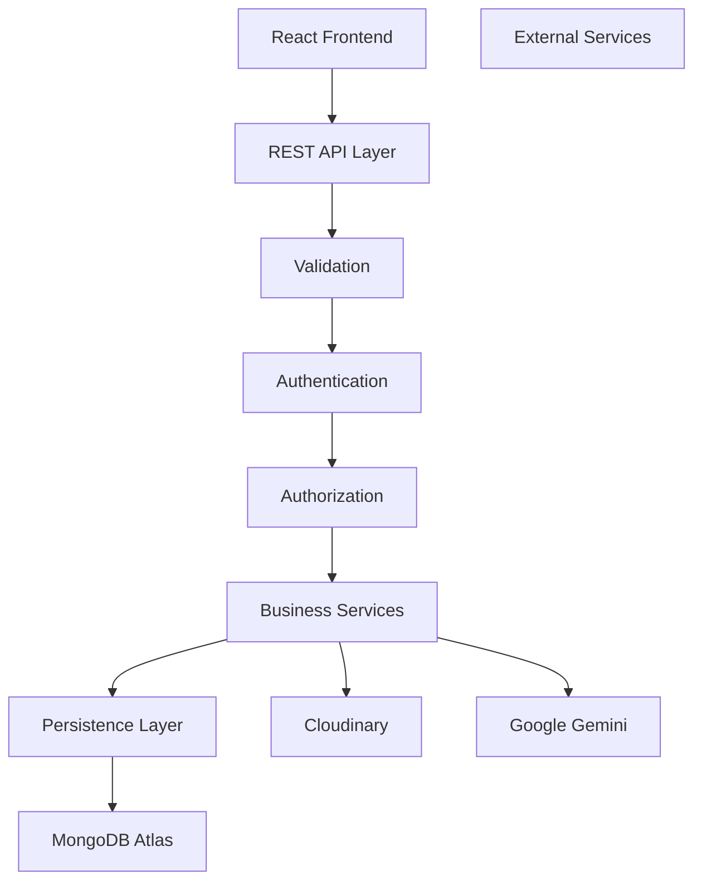
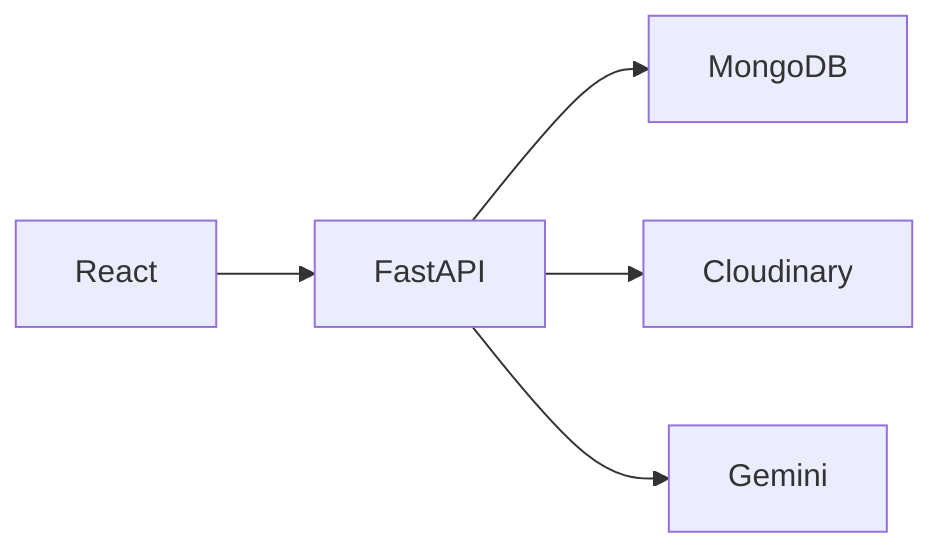
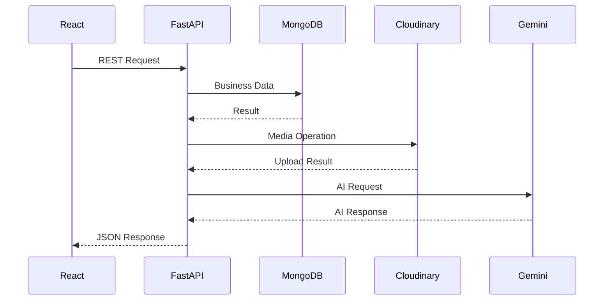
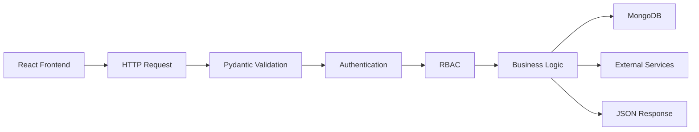
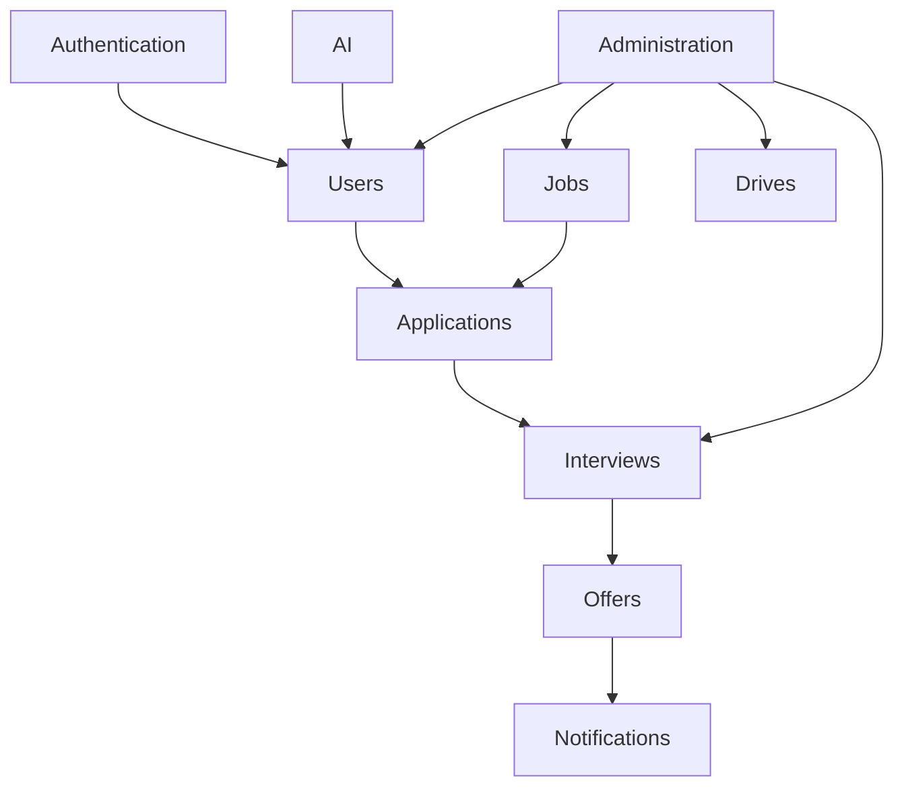
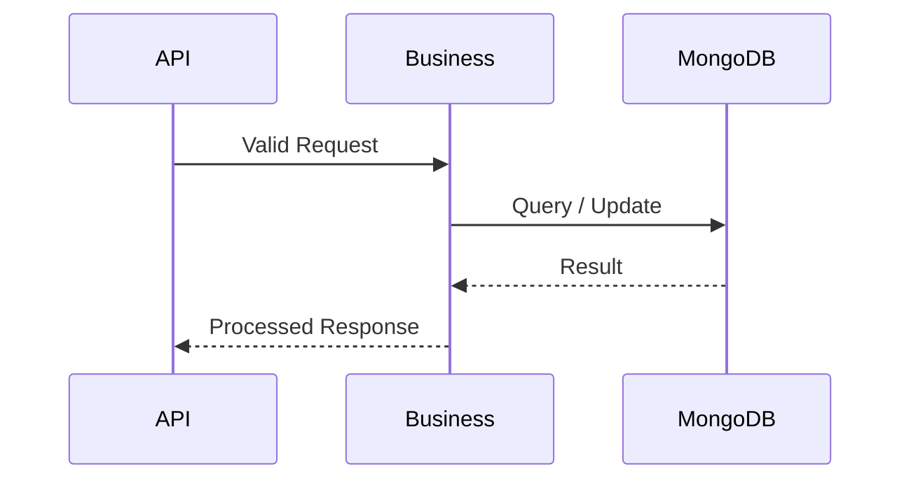
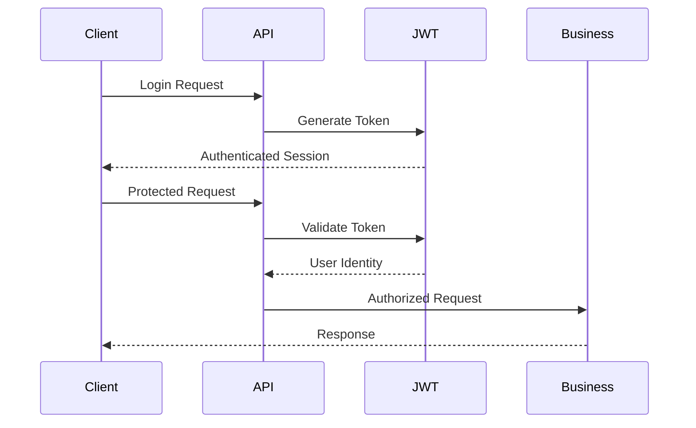
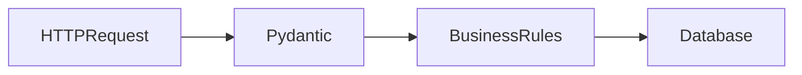

# PlacementHub Backend Guide

> Backend Engineering Standards and Development Guide

---

## Document Information

| Field | Value |
|--------|-------|
| Document Name | Backend Guide |
| Project | PlacementHub |
| Version | 1.0.0 |
| Status | Draft |
| Owner | Anand Sagar |
| Scope | Backend Application |
| Parent Document | 00_PROJECT_DNA.md |
| Depends On | 01_ARCHITECTURE.md |
| Last Updated | 2026-08-03 |

---

## Purpose

This document defines the backend engineering standards, architecture, development practices, implementation guidelines, and operational principles for the PlacementHub backend application.

It serves as the primary engineering reference for backend development and should be used together with the Project DNA, Architecture, System Design, Database Schema, and API Reference documents.

---

## Audience

This document is intended for:

- Backend Developers
- Full-Stack Developers
- Software Engineers
- Technical Reviewers
- Future Contributors
- AI Coding Assistants

---

## Scope

This guide documents the backend architecture, request lifecycle, service organization, API implementation strategy, data access patterns, authentication, validation, coding conventions, configuration management, operational practices, and future architectural evolution.

Business workflows, database schema definitions, and API specifications are documented separately.

---

# Backend Overview

The PlacementHub backend is implemented as a centralized FastAPI application responsible for executing all business workflows, enforcing security policies, validating user requests, and coordinating communication between the frontend, database, and external services.

The backend serves as the authoritative execution layer of the platform.

Unlike the frontend, the backend contains the complete business logic of PlacementHub. Every placement workflow—including authentication, profile management, recruiter approval, job applications, campus drives, interviews, offers, notifications, AI features, and administrative operations—is executed here.

The backend exposes a REST API consumed by the React frontend while ensuring that all business rules remain centrally enforced.

Primary backend responsibilities include:

- Authentication & Authorization
- Business Workflow Execution
- REST API Processing
- Request Validation
- Database Operations
- Document Management
- Notification Management
- AI Integration
- Audit Logging
- Security Enforcement
- Administrative Operations

---

# Technology Stack

PlacementHub's backend is built using modern Python technologies selected for maintainability, scalability, asynchronous processing, and long-term developer productivity.

| Layer | Technology | Responsibility |
|--------|------------|----------------|
| Framework | FastAPI | REST API framework |
| Language | Python | Backend application development |
| Validation | Pydantic | Request and response validation |
| Database Driver | Motor | Asynchronous MongoDB communication |
| Database | MongoDB Atlas | Primary operational database |
| Authentication | JWT | Stateless authentication |
| Password Hashing | bcrypt | Secure password storage |
| AI Integration | Google Gemini | AI-powered services |
| Media Storage | Cloudinary | Secure document storage |
| ASGI Server | Uvicorn | Backend application server |
| Deployment | Render | Cloud backend hosting |

The selected technologies prioritize developer productivity while supporting enterprise-grade backend architecture.

---

# Backend Architecture

PlacementHub follows a layered backend architecture.

Each layer has a clearly defined responsibility and communicates through well-defined interfaces.

Business rules remain centralized inside the application layer while infrastructure concerns are isolated wherever practical.



---

# Backend Design Principles

The backend follows several engineering principles.

- Single source of business truth.
- Stateless request processing.
- API-first architecture.
- Secure-by-default implementation.
- Clear separation between validation and business logic.
- Database remains inaccessible from clients.
- Consistent error handling.
- Modular business domains.
- Future-ready architecture.

Every new backend feature should comply with these principles.

---

# Project Structure

The backend is organized around application responsibilities rather than technical complexity.

Current project organization includes:

```text
backend/

├── server.py
├── services/
├── tests/
├── requirements.txt
├── runtime.txt
├── Procfile
└── pytest.ini
```

Although the current implementation is centered around a single FastAPI application, the architecture is intentionally designed to support future modularization.

---

# Directory Responsibilities

Each backend directory has a clearly defined responsibility.

| Directory / File | Responsibility |
|------------------|----------------|
| server.py | FastAPI application, API endpoints, request processing, business workflow implementation |
| services/ | Shared backend services and reusable infrastructure modules |
| tests/ | Automated backend tests |
| requirements.txt | Python dependency management |
| runtime.txt | Python runtime configuration |
| Procfile | Deployment process definition |
| pytest.ini | Backend testing configuration |

Generated files and runtime artifacts should never be committed unless explicitly required.

---

# Backend Layer Responsibilities

The backend is divided into logical responsibility layers.

| Layer | Responsibility |
|--------|----------------|
| API Layer | HTTP request handling and response generation |
| Validation Layer | Request validation using Pydantic models |
| Authentication Layer | Identity verification and session handling |
| Authorization Layer | Role-Based Access Control |
| Business Layer | Placement workflows and business rules |
| Persistence Layer | MongoDB operations |
| Integration Layer | Cloudinary, Gemini, email, and future third-party services |

Each layer should remain focused on a single architectural responsibility.

---

# Architectural Boundaries

Business logic must remain inside the backend.

The frontend is responsible only for presentation.

The database stores persistent business data.

External services extend functionality without becoming part of the core business workflow.



---

# Backend Responsibilities

The backend is responsible for executing every critical business operation.

Major responsibilities include:

- User registration
- Login
- Authentication
- Authorization
- Student management
- Recruiter management
- Placement administration
- Profile management
- Document verification
- Job lifecycle management
- Application lifecycle management
- Campus drive management
- Interview management
- Offer management
- Notification generation
- Dashboard aggregation
- Analytics generation
- AI request processing
- Audit logging
- Password reset workflow

Business decisions should never be delegated to the frontend.

---

# Service Interaction Model

The backend coordinates interactions between multiple internal and external components.



---

# Backend Quality Goals

The backend architecture is designed to satisfy the following quality attributes.

- Maintainability
- Reliability
- Security
- Scalability
- Testability
- Extensibility
- Predictability
- Operational simplicity

Every future architectural change should improve one or more of these qualities without compromising the others.

---

# Request Processing Pipeline

Every client request follows a standardized processing pipeline before a response is returned.

The pipeline ensures that requests are authenticated, validated, authorized, processed according to business rules, persisted when necessary, and logged where appropriate.

This predictable execution model simplifies debugging, improves maintainability, and enforces consistent behavior across the platform.



---

## Request Lifecycle

Every request progresses through the following stages.

| Stage | Responsibility |
|---------|----------------|
| Request Reception | Accept incoming HTTP request |
| Validation | Validate request body, query parameters, and path parameters |
| Authentication | Identify authenticated user |
| Authorization | Verify role and permissions |
| Business Execution | Execute workflow logic |
| Database Operation | Read or update persistent data |
| External Integration | Invoke Cloudinary, Gemini, or other external services when required |
| Response Generation | Return standardized JSON response |

Every protected endpoint follows this lifecycle.

---

# API Organization

The PlacementHub backend exposes a REST API organized around business domains rather than database collections.

Each endpoint group represents an independent business capability.

---

## Authentication APIs

Responsibilities include:

- User Registration
- Login
- Current User
- Password Reset
- Session Management

---

## Student APIs

Responsibilities include:

- Profile Management
- Document Upload
- Job Discovery
- Applications
- Campus Drives
- Interviews
- Offers
- Dashboard
- AI Features

---

## Recruiter APIs

Responsibilities include:

- Company Profile
- Job Management
- Candidate Review
- Interview Management
- Offer Management
- Dashboard

---

## Administrator APIs

Responsibilities include:

- Student Verification
- Recruiter Approval
- User Management
- Staff Management
- Audit Logs
- Analytics
- Platform Governance

---

## Shared APIs

Shared functionality includes:

- Notifications
- Calendar
- Events
- AI Chat
- Profile Information

Business domains remain isolated while sharing common authentication and authorization infrastructure.

---

# Business Services

The backend implements multiple logical business services.

Although the current implementation resides within a single FastAPI application, each business capability behaves as an independent service.

---

## Authentication Service

Responsibilities include:

- Registration
- Login
- Password hashing
- JWT generation
- Password reset
- Session validation

---

## User Management Service

Responsibilities include:

- Student lifecycle
- Recruiter lifecycle
- Administrator lifecycle
- Profile updates
- User lookup
- Placement status

---

## Job Management Service

Responsibilities include:

- Job creation
- Job publication
- Job updates
- Job deletion
- Eligibility validation
- Applicant counting

---

## Application Service

Responsibilities include:

- Job applications
- Status tracking
- Application history
- Timeline management
- Selection workflow

---

## Campus Drive Service

Responsibilities include:

- Drive creation
- Moderation
- Registration
- Student participation
- Attendance management

---

## Interview Service

Responsibilities include:

- Scheduling
- Rescheduling
- Student responses
- Interview feedback
- Interview completion

---

## Offer Service

Responsibilities include:

- Offer generation
- Offer acceptance
- Offer rejection
- Placement freeze
- Offer history

---

## Notification Service

Responsibilities include:

- In-app notifications
- Administrative alerts
- Workflow notifications
- Interview reminders
- Offer notifications

---

## AI Service

Responsibilities include:

- Profile review
- Career recommendations
- Conversational assistant
- AI-generated guidance

AI functionality remains isolated from critical placement workflows.

---

## Administration Service

Responsibilities include:

- Verification
- Recruiter approval
- Audit logging
- Analytics
- Dashboard aggregation
- Platform governance

---

# Service Interaction

Business services collaborate to complete complex placement workflows.



Services remain logically separated even though they currently execute inside a single backend application.

---

# Database Access Pattern

PlacementHub uses MongoDB as the authoritative operational datastore.

Database access is performed exclusively by the backend.

Clients never communicate directly with MongoDB.

---

## Access Principles

The backend follows these principles when interacting with the database.

- Backend owns all database access.
- Collections represent business domains.
- Business validation occurs before persistence.
- Database operations remain asynchronous.
- Server-generated identifiers are used throughout the platform.
- Updates should remain as targeted as possible.
- Business workflows should avoid unnecessary database operations.

---

## Collection Organization

Major collections include:

- Users
- Jobs
- Applications
- Offers
- Drives
- Drive Registrations
- Interviews
- Interview Feedback
- Events
- Notifications
- Audit Logs
- Security Logs
- Password Reset OTP
- Chat Messages

Detailed collection schemas are documented separately in **03_DATABASE_SCHEMA.md**.

---

## Database Interaction Flow



Business services remain responsible for interpreting database results before returning responses to clients.

---

# Authentication & Authorization

PlacementHub implements centralized authentication and authorization to protect business operations and ensure that users access only the resources permitted by their assigned roles.

Authentication establishes user identity, while authorization determines the operations that an authenticated user is allowed to perform.

The backend is the sole authority responsible for enforcing access control.

---

## Authentication Flow



---

## Authorization Model

PlacementHub follows Role-Based Access Control (RBAC).

Current application roles include:

| Role | Responsibilities |
|------|------------------|
| Student | Placement participation |
| Recruiter | Recruitment management |
| Placement Administrator | Platform governance |

Authorization decisions should always be performed before executing business logic.

---

## Authentication Principles

The backend follows these principles:

- Every protected endpoint requires authentication.
- Authorization is validated for every protected request.
- JWT represents authenticated identity only.
- Business permissions remain server-side.
- Authentication failures terminate request processing immediately.
- Authorization failures never expose protected resources.

---

# Validation Strategy

Request validation protects backend integrity before business processing begins.

Validation is performed using Pydantic models.

---

## Validation Responsibilities

Validation includes:

- Request body validation
- Query parameter validation
- Path parameter validation
- Type validation
- Required field validation
- Field constraints
- Default values
- Data normalization

Business validation is performed after structural validation succeeds.

---

## Validation Flow



---

## Validation Principles

Validation should:

- Reject malformed requests.
- Produce consistent error responses.
- Validate before database access.
- Separate structural validation from business validation.
- Keep validation predictable.

---

# Error Handling

PlacementHub provides standardized error handling across all backend operations.

Errors should remain predictable, informative, and secure.

---

## Error Categories

Typical backend errors include:

- Validation Errors
- Authentication Errors
- Authorization Errors
- Resource Not Found
- Business Rule Violations
- Duplicate Resources
- External Service Failures
- Internal Server Errors

---

## Error Handling Principles

The backend should:

- Return appropriate HTTP status codes.
- Produce consistent JSON error responses.
- Avoid exposing internal implementation details.
- Preserve auditability.
- Log unexpected failures.

---

# Configuration Management

Runtime configuration is externalized through environment variables.

Configuration should never be hardcoded.

Typical configuration includes:

- MongoDB Connection
- JWT Secret
- Cloudinary Credentials
- Gemini API Key
- Deployment Environment
- Application URLs
- Email Configuration (Future)

Configuration should remain environment-specific.

---

# Logging & Auditing

PlacementHub distinguishes operational logging from business auditing.

---

## Operational Logging

Operational logs assist debugging and monitoring.

Typical events include:

- Startup
- Shutdown
- Unexpected Exceptions
- External Service Failures

---

## Audit Logging

Audit logs record important business operations.

Examples include:

- Student Verification
- Recruiter Approval
- Staff Creation
- Offer Acceptance
- Administrative Actions
- Security Events

Audit records should remain immutable whenever practical.

---

# Performance Guidelines

Backend performance should support responsive user experience while maintaining correctness.

---

## Performance Objectives

The backend should:

- Minimize database queries.
- Use asynchronous request processing.
- Avoid duplicate computations.
- Reduce unnecessary data transfer.
- Optimize aggregation queries.
- Scale horizontally where appropriate.

---

## Performance Principles

Developers should:

- Query only required fields.
- Keep request handlers focused.
- Avoid blocking operations.
- Batch database operations where practical.
- Optimize indexes as data grows.
- Profile before optimizing.

---

# Security Considerations

Security is integrated throughout the backend architecture.

Primary security measures include:

- JWT Authentication
- Role-Based Access Control
- Password Hashing
- Input Validation
- Server-side Authorization
- Audit Logging
- Secure Password Reset
- Protected Administrative Operations
- Secure External Service Integration

Security requirements are documented comprehensively in **07_SECURITY.md**.

---

# Coding Standards

Backend code should remain consistent across the project.

General guidelines include:

- Prefer descriptive names.
- Keep functions focused.
- Minimize duplicated logic.
- Separate validation from business rules.
- Prefer asynchronous operations.
- Keep endpoint implementations readable.
- Document complex decisions.
- Maintain predictable API behavior.
- Remove unused code before merging.

---

# Future Modularization

The current backend is implemented as a centralized FastAPI application.

Future architectural evolution may introduce:

```text
backend/

├── api/
├── routers/
├── services/
├── repositories/
├── models/
├── schemas/
├── middleware/
├── core/
├── integrations/
├── utils/
└── tests/
```

Potential improvements include:

- Router-based endpoint organization.
- Service layer extraction.
- Repository pattern.
- Dependency injection.
- Background task processing.
- Redis caching.
- Message queues.
- Event-driven integrations.
- Microservice evaluation where justified.

Future refactoring should preserve API compatibility whenever practical.

---

# Related Documentation

This document should be read together with:

- 00_PROJECT_DNA.md
- 01_ARCHITECTURE.md
- 02_SYSTEM_DESIGN.md
- 03_DATABASE_SCHEMA.md
- 04_API_REFERENCE.md
- 05_FRONTEND_GUIDE.md
- 07_SECURITY.md
- 08_DEPLOYMENT.md
- 09_TESTING.md

---

# Revision History

| Version | Date | Description |
|----------|------|-------------|
| 1.0.0 | 2026-08-03 | Initial backend engineering guide. |