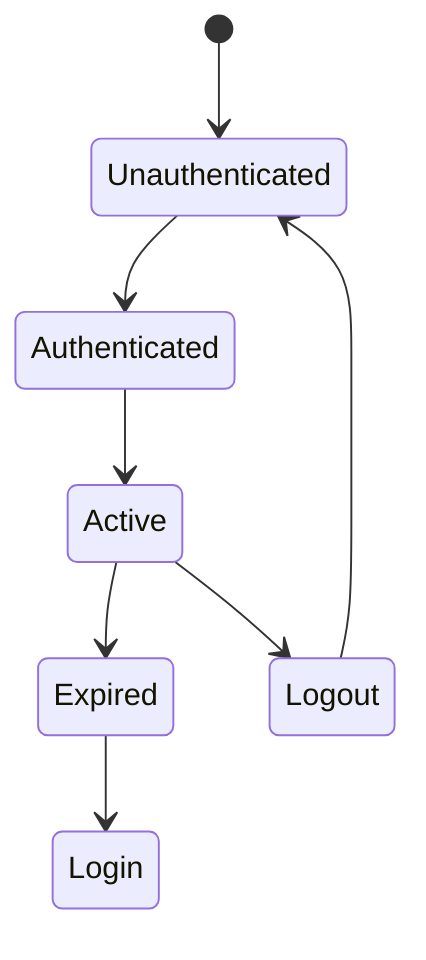
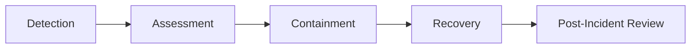

# PlacementHub Security Guide

> Enterprise Security Standards and Operational Security Guide

---

## Document Information

---

## Purpose

---

## Audience

---

## Scope

---

# Table of Contents

1. Security Overview
2. Security Objectives
3. Security Principles
4. Threat Model
5. Authentication Security
6. Authorization Security
7. Password Security
8. Session Security
9. API Security
10. Input Validation
11. Data Protection
12. Document Security
13. AI Security
14. Audit & Logging
15. Secrets Management
16. Security Headers
17. Dependency Security
18. Secure Development Practices
19. Incident Response
20. Security Checklist
21. Related Documentation
22. Revision History

# PlacementHub Security Guide

> Enterprise Security Standards and Operational Security Guide

---

## Document Information

| Field | Value |
|--------|-------|
| Document Name | Security Guide |
| Project | PlacementHub |
| Version | 1.0.0 |
| Status | Draft |
| Owner | Anand Sagar |
| Scope | Entire Platform Security |
| Parent Document | 00_PROJECT_DNA.md |
| Depends On | 01_ARCHITECTURE.md |
| Last Updated | 2026-08-03 |

---

## Purpose

This document defines the security standards, policies, operational practices, and engineering guidelines for the PlacementHub platform.

It serves as the primary reference for securing application components, protecting user data, enforcing access control, managing credentials, and supporting secure software development throughout the project lifecycle.

---

## Audience

This document is intended for:

- Backend Developers
- Frontend Developers
- Full-Stack Developers
- Software Engineers
- Technical Reviewers
- Future Contributors
- AI Coding Assistants

---

## Scope

This guide documents authentication, authorization, session management, API security, data protection, secure development practices, operational security, audit requirements, and incident response.

Business workflows and implementation details are documented separately in other engineering documents.

---

# Security Overview

Security is a foundational engineering requirement for PlacementHub.

Rather than being implemented as a separate feature, security is integrated throughout the entire platform architecture, development process, deployment strategy, and operational lifecycle.

Every business workflow is expected to satisfy confidentiality, integrity, and availability requirements while remaining maintainable and scalable.

Security controls are enforced primarily by the backend, while the frontend supports a secure and predictable user experience.

Protection mechanisms extend across authentication, authorization, data validation, document management, API communication, audit logging, and infrastructure configuration.

---

# Security Objectives

PlacementHub aims to achieve the following security objectives.

- Protect user identities.
- Prevent unauthorized access.
- Preserve data integrity.
- Protect confidential information.
- Secure document storage.
- Maintain auditability.
- Minimize attack surface.
- Support secure software development.
- Enable future compliance initiatives.

---

# Security Principles

The platform follows the following engineering principles.

- Security by Design
- Least Privilege
- Defense in Depth
- Zero Trust between client and server
- Fail Securely
- Secure Defaults
- Server-side Enforcement
- Auditability
- Minimal Data Exposure
- Continuous Improvement

Every new feature should comply with these principles before implementation.

---

# Threat Model

PlacementHub protects against common application threats affecting web-based placement management systems.

Primary threat categories include:

| Threat | Example |
|---------|----------|
| Credential Theft | Password compromise |
| Unauthorized Access | Role escalation |
| Session Hijacking | Token misuse |
| Injection Attacks | Malicious input |
| Broken Access Control | Unauthorized resource access |
| File Upload Abuse | Malicious document uploads |
| Data Exposure | Sensitive information leakage |
| API Abuse | Automated or excessive requests |
| External Service Failure | AI or cloud storage outages |
| Insider Misuse | Administrative privilege abuse |

Security controls are designed to reduce both likelihood and impact of these threats.

---

# Authentication Security

Authentication establishes user identity before access to protected resources is granted.

PlacementHub follows these authentication policies.

- Every protected endpoint requires authentication.
- Authentication is validated by the backend.
- Passwords are never stored in plaintext.
- Authentication state must expire appropriately.
- Authentication failures are logged when necessary.
- Password reset requires identity verification.
- Authentication logic remains centralized.

---

# Authorization Security

Authentication identifies users, while authorization determines the operations they are permitted to perform.

PlacementHub enforces authorization exclusively on the backend using Role-Based Access Control (RBAC).

Authorization decisions are evaluated before any protected business operation is executed.

---

## Authorization Model

The platform currently defines three primary security roles.

| Role | Access Scope |
|------|--------------|
| Student | Placement participation, profile management, job applications, interviews, offers |
| Recruiter | Recruitment workflows, job management, candidate evaluation, interviews |
| Placement Administrator | Platform governance, verification, approvals, analytics, audit management |

Every protected API endpoint validates user permissions before executing business logic.

---

## Authorization Principles

The platform follows these authorization principles.

- Default deny unless explicitly permitted.
- Backend is the source of truth.
- Permissions are role-driven.
- Least privilege is applied.
- Administrative operations require elevated privileges.
- Authorization checks occur before business processing.

---

# Password Security

Passwords represent the primary authentication secret for user accounts.

The platform adopts secure password handling practices to minimize the risk of credential compromise.

---

## Password Policy

Passwords should satisfy organizational security requirements.

Recommended requirements include:

- Minimum length requirement.
- Strong character diversity.
- Prevention of common passwords.
- No plaintext storage.
- Secure hashing before persistence.

Password policies may evolve as security requirements change.

---

## Password Storage

Passwords must never be stored, transmitted, or logged in plaintext.

PlacementHub stores only securely hashed passwords using bcrypt.

The backend remains solely responsible for password hashing and verification.

---

## Password Reset

Password reset operations should require identity verification before allowing credential changes.

Typical workflow includes:

1. Password reset request.
2. Identity verification.
3. One-Time Password (OTP) validation.
4. Password update.
5. Previous reset tokens invalidated.

Expired or previously used reset requests must not be reusable.

---

# Session Security

Authenticated sessions represent a user's verified identity throughout application usage.

Session management should minimize the risk of unauthorized reuse.

---

## Session Principles

PlacementHub follows these principles.

- Sessions originate after successful authentication.
- Protected requests require authenticated sessions.
- Invalid sessions are rejected.
- Logout immediately terminates authenticated access.
- Session expiration is enforced by the backend.
- Expired sessions require re-authentication.

---

## Session Lifecycle

---

# API Security

The REST API represents the primary communication boundary of PlacementHub.

Every API endpoint should be treated as a security boundary.

---

## API Protection

Protected endpoints should enforce:

- Authentication
- Authorization
- Request validation
- Input sanitization
- Business rule validation
- Consistent error responses

Public endpoints should expose only the minimum functionality required.

---

## API Security Principles

- HTTPS-only communication.
- Server-side validation.
- Consistent authentication.
- Predictable authorization.
- No direct database exposure.
- Secure error responses.
- Minimal response data.

---

# Input Validation

All external input is considered untrusted until validated.

Validation protects both application stability and data integrity.

---

## Validation Categories

Validation should include:

- Type validation
- Required fields
- Length constraints
- Range validation
- Format validation
- Enumeration validation
- File validation
- Business rule validation

Validation should occur before any persistence or workflow execution.

---

## Validation Principles

- Reject malformed requests.
- Validate early.
- Normalize input when appropriate.
- Never trust client-side validation.
- Produce consistent validation errors.

---

# Data Protection

PlacementHub stores operational and personally identifiable information.

Data protection measures should preserve confidentiality, integrity, and availability.

---

## Protected Data

Examples include:

- User profiles
- Email addresses
- Placement history
- Uploaded documents
- Authentication credentials
- Administrative records
- Audit logs

Sensitive information should only be exposed to authorized users.

---

## Data Protection Principles

- Minimize stored sensitive data.
- Protect personal information.
- Restrict administrative visibility.
- Secure data transmission.
- Preserve auditability.
- Follow least-privilege access.

---

# Document Security

PlacementHub supports secure document management for placement activities.

Document security includes:

- File type validation.
- File size validation.
- Authorized uploads.
- Authorized downloads.
- Secure cloud storage.
- Controlled document visibility.

Document ownership should always be verified before access is granted.

---

# AI Security

Artificial Intelligence enhances user productivity but must not bypass established security controls.

---

## AI Security Principles

- AI never replaces authorization.
- AI responses must not expose confidential information.
- AI failures must not interrupt critical business workflows.
- AI requests should remain isolated from authentication logic.
- Administrative decisions remain human-controlled.

---

# Secrets Management

Application secrets require strict protection.

Typical secrets include:

- JWT Secret
- Database Connection String
- Gemini API Key
- Cloudinary Credentials
- SMTP Credentials (Future)

---

## Secrets Management Principles

- Never hardcode secrets.
- Store secrets in environment variables.
- Rotate secrets when required.
- Restrict access to deployment environments.
- Never commit secrets to source control.

---

# Security Headers

HTTP responses should include appropriate security headers where supported.

Examples include:

- Strict-Transport-Security
- X-Content-Type-Options
- X-Frame-Options
- Referrer-Policy
- Content-Security-Policy

Header configuration should be managed centrally.

---

# Dependency Security

Third-party dependencies introduce operational risk.

Developers should:

- Keep dependencies updated.
- Remove unused packages.
- Monitor security advisories.
- Prefer actively maintained libraries.
- Review dependency changes before upgrades.

---

# Secure Development Practices

Security is integrated into the software development lifecycle rather than introduced after implementation.

Every code change should be evaluated not only for functionality but also for its security impact.

Developers are expected to follow secure engineering practices throughout design, implementation, testing, code review, and deployment.

---

## Secure Coding Principles

Backend and frontend developers should adhere to the following practices.

- Validate all external input.
- Never trust client-side validation.
- Keep business logic on the server.
- Avoid hardcoded credentials.
- Sanitize user-provided data.
- Handle errors securely.
- Protect sensitive information.
- Follow the Principle of Least Privilege.
- Prefer secure defaults over configurable insecurity.
- Remove unused code and dependencies.

---

## Code Review Security Checklist

Every pull request should include a security review.

Typical review questions include:

- Does the change introduce a new attack surface?
- Are authorization checks present where required?
- Is user input properly validated?
- Could sensitive information be exposed?
- Are secrets handled correctly?
- Does the implementation follow existing security standards?
- Are audit events generated when necessary?

Security review should become part of the normal development workflow rather than a separate activity.

---

## Third-Party Libraries

Before introducing a new dependency, developers should evaluate:

- Project maintenance activity.
- Security history.
- Community adoption.
- License compatibility.
- Long-term sustainability.

Dependencies should be updated regularly to reduce exposure to known vulnerabilities.

---

# Incident Response

Despite preventive controls, security incidents may still occur.

The platform should respond quickly while preserving evidence and minimizing operational impact.

---

## Incident Lifecycle

---

## Incident Handling Principles

Security incidents should follow these principles.

- Detect suspicious activity quickly.
- Assess severity before taking corrective action.
- Contain the affected component where practical.
- Preserve audit logs.
- Restore normal operations safely.
- Review root causes after recovery.
- Implement corrective improvements.

Incident handling should prioritize both operational continuity and protection of user data.

---

# Security Checklist

The following checklist summarizes the minimum security expectations for PlacementHub.

| Area | Status |
|------|--------|
| Authentication enforced | ✓ |
| Role-Based Access Control | ✓ |
| Password hashing | ✓ |
| Server-side validation | ✓ |
| HTTPS communication | ✓ |
| Protected API endpoints | ✓ |
| Secure password reset | ✓ |
| Audit logging | ✓ |
| Input validation | ✓ |
| Secure document handling | ✓ |
| Secrets managed through environment variables | ✓ |
| Backend-only database access | ✓ |
| AI isolated from critical workflows | ✓ |

This checklist should be reviewed periodically as the platform evolves.

---

# Security Compliance Goals

Although PlacementHub is not currently intended to achieve formal regulatory certification, its architecture aligns with widely accepted secure software engineering practices.

The platform is designed with consideration for:

- OWASP Top 10 mitigation principles
- Defense in Depth
- Least Privilege
- Secure by Design
- Zero Trust principles
- Secure Software Development Lifecycle (SSDLC)

Future compliance requirements may introduce additional organizational controls without requiring fundamental architectural redesign.

---

# Related Documentation

This document should be read together with the following engineering documents.

- 00_PROJECT_DNA.md
- 01_ARCHITECTURE.md
- 02_SYSTEM_DESIGN.md
- 03_DATABASE_SCHEMA.md
- 04_API_REFERENCE.md
- 05_FRONTEND_GUIDE.md
- 06_BACKEND_GUIDE.md
- 08_DEPLOYMENT.md
- 09_TESTING.md

---

# Revision History

| Version | Date | Description |
|----------|------|-------------|
| 1.0.0 | 2026-08-03 | Initial enterprise security guide. |

