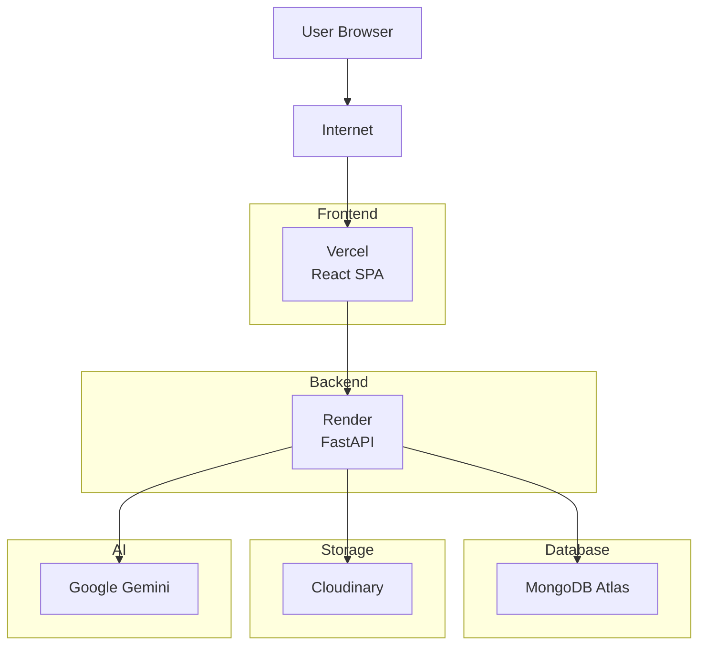
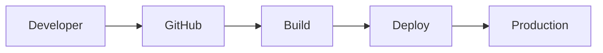

# PlacementHub Deployment Guide

> Infrastructure, Deployment Strategy, and Operations Guide

---

## Document Information

| Field | Value |
|--------|-------|
| Document Name | Deployment Guide |
| Project | PlacementHub |
| Version | 1.0.0 |
| Status | Draft |
| Owner | Anand Sagar |
| Scope | Infrastructure & Deployment |
| Parent Document | 00_PROJECT_DNA.md |
| Depends On | 01_ARCHITECTURE.md |
| Last Updated | 2026-08-03 |

---

## Purpose

This document defines the deployment architecture, infrastructure strategy, runtime configuration, operational practices, and deployment standards for PlacementHub.

It serves as the primary engineering reference for deploying, operating, maintaining, and scaling the platform across development, staging, and production environments.

---

## Audience

This document is intended for:

- Backend Developers
- Frontend Developers
- DevOps Engineers
- Technical Reviewers
- Future Contributors
- AI Coding Assistants

---

## Scope

This guide documents deployment architecture, infrastructure organization, environment configuration, release strategy, monitoring, backup strategy, disaster recovery, and future infrastructure evolution.

Application implementation details are documented separately.

---

# Deployment Overview

PlacementHub follows a distributed cloud deployment architecture in which the frontend, backend, database, and managed services are deployed independently.

Each infrastructure component has a clearly defined operational responsibility.

The deployment architecture emphasizes:

- Independent deployments
- Managed cloud infrastructure
- Secure communication
- Stateless backend services
- Cloud-native scalability
- Operational simplicity

Current production deployment uses:

- Vercel for the frontend
- Render for the backend
- MongoDB Atlas for data persistence
- Cloudinary for media storage
- Google Gemini for AI services

---

# Deployment Architecture

---

# Infrastructure Components

| Component | Technology | Responsibility |
|-----------|------------|----------------|
| Frontend | Vercel | React application hosting |
| Backend | Render | FastAPI application hosting |
| Database | MongoDB Atlas | Persistent application data |
| Media Storage | Cloudinary | Document and image storage |
| AI Platform | Google Gemini | AI-powered capabilities |

Each infrastructure component can evolve independently without requiring changes to the remaining deployment architecture.

---

# Environment Strategy

PlacementHub supports multiple deployment environments to isolate development activities from production operations.

| Environment | Purpose |
|-------------|---------|
| Development | Local development and debugging |
| Staging (Future) | Pre-production validation |
| Production | Live platform |

Each environment should maintain independent configuration and credentials.

Production secrets must never be reused in development environments.

---

# Environment Configuration

Application configuration should be provided through environment variables.

Typical runtime configuration includes:

- Database Connection URI
- JWT Secret
- Cloudinary Credentials
- Gemini API Key
- Frontend URL
- Backend URL
- Deployment Environment

Configuration files must never contain production secrets.

Environment-specific configuration should remain external to the application source code.

---

# Deployment Pipeline

Every production release follows a predictable deployment lifecycle.

Deployment should occur only after successful code review and validation.

---

# Release Strategy

PlacementHub follows an incremental release strategy.

General release principles include:

- Small deployment batches.
- Verified production builds.
- Version-controlled releases.
- Rollback capability.
- Deployment verification.
- Documentation updates with architectural changes.

Large deployments should be avoided whenever practical.

---

# Runtime Responsibilities

Each runtime component has a clearly defined operational responsibility.

| Component | Responsibility |
|-----------|----------------|
| React | User interface rendering |
| FastAPI | Business processing |
| MongoDB | Persistent storage |
| Cloudinary | Media delivery |
| Gemini | AI inference |

Business workflows remain centralized within the backend.

---

# Monitoring & Observability

Continuous monitoring enables early detection of operational issues and improves overall platform reliability.

Monitoring should provide visibility into application health, infrastructure status, performance metrics, and operational failures.

The monitoring strategy should evolve alongside application complexity.

---

## Monitoring Objectives

The deployment should continuously monitor:

- Backend availability
- Frontend availability
- Database connectivity
- API response times
- Error rates
- Deployment status
- External service availability
- Resource utilization

Monitoring should prioritize operational awareness without introducing unnecessary system complexity.

---

## Health Monitoring

Every major infrastructure component should expose an observable health status.

Typical health indicators include:

| Component | Health Indicator |
|-----------|------------------|
| Frontend | Application Availability |
| Backend | API Health Endpoint |
| MongoDB | Database Connectivity |
| Cloudinary | Upload Availability |
| Gemini | AI Service Availability |

Health checks should remain lightweight and independent of business workflows.

---

# Logging Strategy

Operational logging supports debugging, monitoring, and incident investigation.

Logging should provide sufficient operational insight while protecting sensitive information.

---

## Logging Principles

Logs should:

- Record operational events.
- Capture unexpected failures.
- Support troubleshooting.
- Preserve chronological execution.
- Avoid logging sensitive information.
- Remain structured and searchable.

Passwords, authentication secrets, and confidential user information must never appear in logs.

---

## Log Categories

Typical log categories include:

- Application Startup
- Application Shutdown
- Request Processing
- Authentication Events
- Deployment Events
- External Service Errors
- Unexpected Exceptions

Business audit records are documented separately in the Security Guide.

---

# Backup Strategy

Persistent application data should be protected through regular backup procedures.

Backup strategies should minimize data loss while supporting timely recovery.

---

## Backup Objectives

The platform should support:

- Regular database backups.
- Secure backup storage.
- Backup verification.
- Controlled restoration procedures.
- Disaster recovery readiness.

Media stored in Cloudinary should follow the provider's managed redundancy strategy.

---

# Disaster Recovery

Infrastructure failures should not permanently compromise platform availability or data integrity.

The deployment architecture should support predictable recovery procedures.

---

## Recovery Priorities

Recovery efforts should prioritize:

1. Platform availability.
2. Database restoration.
3. Authentication functionality.
4. Core placement workflows.
5. AI features.
6. Administrative services.

Non-essential services may remain temporarily unavailable while critical functionality is restored.

---

# Scalability Strategy

PlacementHub is designed to support future organizational growth without requiring significant architectural redesign.

Scalability considerations apply to both infrastructure and application architecture.

---

## Horizontal Scalability

Future deployment may support:

- Multiple backend instances.
- Load balancing.
- Independent frontend scaling.
- Database optimization.
- Distributed caching.
- Background processing.

The current architecture intentionally preserves compatibility with future scaling initiatives.

---

## Vertical Scalability

Infrastructure resources may be increased through:

- Additional CPU
- Increased Memory
- Higher Storage Capacity
- Improved Network Throughput

Vertical scaling provides a straightforward path for supporting moderate traffic growth.

---

# CI/CD Strategy

Continuous Integration and Continuous Deployment may be introduced as the project evolves.

Future automation should include:

- Automated builds.
- Automated testing.
- Deployment validation.
- Version tagging.
- Release automation.
- Rollback support.

Deployment automation should never bypass required code review or testing procedures.

---

# Rollback Strategy

Every production deployment should support rollback in the event of operational failure.

Rollback objectives include:

- Minimize downtime.
- Restore previous stable release.
- Preserve persistent data.
- Prevent inconsistent deployments.

Rollback procedures should be documented and periodically reviewed.

---

# Operational Best Practices

Deployment operations should follow consistent engineering practices.

General recommendations include:

- Maintain environment isolation.
- Protect production credentials.
- Monitor deployments.
- Verify application health after releases.
- Keep infrastructure documentation current.
- Minimize manual production changes.
- Document operational incidents.

Operational consistency reduces deployment risk and improves long-term maintainability.

---

# Future Infrastructure Evolution

The current deployment architecture is intentionally designed to support future infrastructure improvements.

Potential enhancements include:

- Docker containerization
- Kubernetes orchestration
- Redis caching
- Background worker services
- Message queues
- CDN optimization
- Infrastructure as Code
- Blue-Green deployments
- Canary releases
- Centralized monitoring
- Distributed tracing

Infrastructure evolution should preserve existing architectural principles while improving scalability and operational resilience.

---

# Related Documentation

This document should be read together with:

- 00_PROJECT_DNA.md
- 01_ARCHITECTURE.md
- 02_SYSTEM_DESIGN.md
- 03_DATABASE_SCHEMA.md
- 04_API_REFERENCE.md
- 05_FRONTEND_GUIDE.md
- 06_BACKEND_GUIDE.md
- 07_SECURITY.md
- 09_TESTING.md

---

# Revision History

| Version | Date | Description |
|----------|------|-------------|
| 1.0.0 | 2026-08-03 | Initial deployment engineering guide. |

