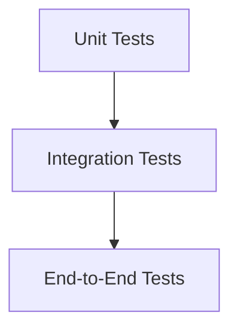
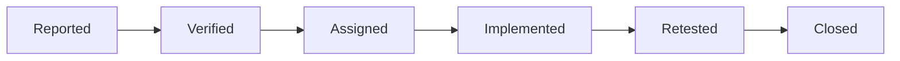

# PlacementHub Testing Guide

> Quality Engineering, Verification, and Testing Standards

---

## Document Information

| Field | Value |
|--------|-------|
| Document Name | Testing Guide |
| Project | PlacementHub |
| Version | 1.0.0 |
| Status | Draft |
| Owner | Anand Sagar |
| Scope | Quality Engineering |
| Parent Document | 00_PROJECT_DNA.md |
| Depends On | 01_ARCHITECTURE.md |
| Last Updated | 2026-08-03 |

---

## Purpose

This document defines the quality engineering strategy, testing standards, verification procedures, and release validation process for PlacementHub.

It serves as the primary reference for ensuring software correctness, reliability, maintainability, and production readiness throughout the project lifecycle.

---

## Audience

This document is intended for:

- Backend Developers
- Frontend Developers
- QA Engineers
- Technical Reviewers
- Future Contributors
- AI Coding Assistants

---

## Scope

This guide documents testing strategy, test organization, quality assurance practices, test automation, release validation, and future testing evolution.

Implementation details for individual features are documented separately.

---

# Testing Overview

Testing is an essential engineering activity that verifies whether PlacementHub behaves according to its documented business rules, architectural decisions, and API contracts.

Testing is integrated throughout the software development lifecycle rather than performed only before deployment.

Every significant feature should be validated before being considered production-ready.

Testing contributes to:

- Software correctness
- Business rule verification
- Regression prevention
- Security validation
- Deployment confidence
- Long-term maintainability

Quality is considered a shared engineering responsibility rather than the responsibility of a single role.

---

# Quality Objectives

PlacementHub aims to achieve the following quality objectives.

- Functional correctness
- Reliable API behavior
- Consistent business workflows
- Secure authentication
- Stable deployments
- Maintainable code
- Predictable user experience
- Low regression risk

---

# Testing Principles

The platform follows these testing principles.

- Test early.
- Test continuously.
- Automate repetitive verification.
- Verify business rules.
- Prevent regressions.
- Prefer deterministic tests.
- Keep tests isolated.
- Maintain readable test cases.
- Update tests alongside implementation changes.

---

# Testing Pyramid

PlacementHub follows a balanced testing strategy.



---

## Unit Tests

Focus:

- Individual functions
- Utility methods
- Validation logic
- Business rules
- Helper functions

Unit tests should execute quickly and remain independent.

---

## Integration Tests

Focus:

- API endpoints
- Database interaction
- Authentication flow
- Business workflows
- External service integration

Integration tests verify collaboration between application components.

---

## End-to-End Tests

Focus:

- Complete user journeys.
- Student workflow.
- Recruiter workflow.
- Administrator workflow.

End-to-end tests validate production-like behavior.

---

# Test Categories

| Category | Purpose |
|----------|----------|
| Unit Testing | Verify isolated logic |
| Integration Testing | Verify component interaction |
| API Testing | Verify REST endpoints |
| Authentication Testing | Verify login and access control |
| Authorization Testing | Verify permissions |
| Database Testing | Verify persistence |
| Security Testing | Verify protection mechanisms |
| Performance Testing | Verify responsiveness |
| Regression Testing | Prevent previously fixed defects |
| User Acceptance Testing | Validate business expectations |

---

# Test Environment

Testing should occur in controlled environments.

Recommended environments include:

| Environment | Purpose |
|------------|----------|
| Local | Developer testing |
| CI Pipeline | Automated verification |
| Staging | Pre-production validation |
| Production | Operational monitoring only |

Production should never be used for experimental testing.

---

# Test Organization

Tests should remain organized according to application responsibilities.

Example structure:

```text
tests/

├── unit/
│   ├── auth/
│   ├── jobs/
│   ├── applications/
│   ├── drives/
│   ├── interviews/
│   └── offers/
│
├── integration/
│   ├── api/
│   ├── database/
│   └── workflows/
│
├── security/
│
├── performance/
│
└── fixtures/
```

The directory structure may evolve while preserving logical separation between testing categories.

---

# Backend Testing

Backend verification should include:

- Authentication
- Authorization
- Validation
- Business workflows
- Database operations
- Notifications
- AI integration
- Administrative operations
- Error handling

Business rules should always be verified independently from the frontend.

---

# Frontend Testing

Frontend verification should include:

- Component rendering
- Routing
- Forms
- Validation
- State management
- API communication
- Protected routes
- Responsive behavior
- Error presentation

Frontend tests should verify user experience without replacing backend validation.

---

# API Testing

API verification should ensure:

- Correct request handling.
- Correct response format.
- Appropriate status codes.
- Authentication enforcement.
- Authorization enforcement.
- Validation behavior.
- Error responses.
- Business workflow execution.

API contracts should remain consistent with **04_API_REFERENCE.md**.

---

# Authentication Testing

Authentication is a critical security boundary and should be verified comprehensively.

Testing should confirm that only authenticated users can access protected resources and that authentication behaves consistently under both normal and exceptional conditions.

---

## Authentication Test Areas

Typical authentication verification includes:

- User registration
- Login
- Logout
- Invalid credentials
- Password reset
- Session expiration
- Unauthorized access
- Protected endpoint access

Authentication testing should verify both successful and unsuccessful scenarios.

---

# Authorization Testing

Authorization testing verifies that users cannot perform actions outside their assigned permissions.

Typical authorization scenarios include:

- Student accessing recruiter resources
- Student accessing administrator resources
- Recruiter accessing administrative endpoints
- Administrator platform management
- Cross-user resource access
- Protected API enforcement

Every protected endpoint should verify permissions before executing business logic.

---

# Security Testing

Security testing validates the platform's ability to resist common application threats.

Representative security verification includes:

- Authentication bypass attempts
- Authorization bypass attempts
- Invalid JWT handling
- Input validation
- Malicious file uploads
- Session misuse
- Password reset abuse
- Sensitive information exposure
- Administrative privilege protection

Security testing should remain aligned with the policies defined in **07_SECURITY.md**.

---

# Performance Testing

Performance testing verifies that PlacementHub continues to provide an acceptable user experience under expected workloads.

---

## Performance Objectives

Testing should evaluate:

- API response time
- Concurrent request handling
- Database query performance
- Dashboard loading
- File upload performance
- AI request latency
- Memory utilization
- CPU utilization

Performance testing should use realistic datasets whenever possible.

---

## Performance Principles

Performance evaluation should:

- Simulate realistic workloads.
- Measure repeatable metrics.
- Identify bottlenecks.
- Preserve application correctness.
- Support future scalability planning.

---

# Test Data Management

Reliable testing requires controlled and repeatable datasets.

Test data should remain isolated from production information.

---

## Test Data Principles

Testing datasets should:

- Represent realistic business scenarios.
- Avoid sensitive production data.
- Support repeatable execution.
- Cover both valid and invalid cases.
- Remain version controlled where practical.

Example datasets include:

- Verified students
- Pending students
- Approved recruiters
- Pending recruiters
- Active jobs
- Campus drives
- Interviews
- Offers

---

# Test Automation

Automated testing improves consistency while reducing manual verification effort.

Automation should prioritize frequently executed and business-critical scenarios.

Typical automation targets include:

- Unit tests
- API tests
- Authentication tests
- Regression suites
- Deployment validation

Automation should complement—not replace—manual exploratory testing.

---

# Continuous Integration Testing

Every code change should be validated before integration into the main development branch.

Typical CI quality checks include:

- Dependency installation
- Static analysis (future)
- Automated unit tests
- Integration tests
- Build verification
- Deployment validation (future)

Failed quality checks should prevent integration until the underlying issues are resolved.

---

# Regression Testing

Regression testing ensures that previously working functionality remains stable after new changes.

Regression coverage should prioritize:

- Authentication
- User management
- Job management
- Applications
- Campus drives
- Interviews
- Offers
- Notifications
- Administrative workflows

Regression testing should accompany every production release.

---

# Defect Management

Software defects should be documented, prioritized, and resolved systematically.

Typical defect lifecycle:



Defects should include sufficient information to reproduce and verify the issue.

---

# Quality Gates

A release should satisfy minimum quality requirements before deployment.

Typical release criteria include:

| Quality Gate | Requirement |
|--------------|-------------|
| Build Success | Required |
| Unit Tests | Pass |
| Integration Tests | Pass |
| API Verification | Pass |
| Authentication Verification | Pass |
| Authorization Verification | Pass |
| Security Validation | Pass |
| Critical Defects | None Open |

Quality gates help maintain consistent software quality across releases.

---

# Release Readiness Checklist

Before deploying a production release, verify that:

- All planned features are complete.
- Automated tests pass.
- Critical defects are resolved.
- Database changes are validated.
- API contracts remain consistent.
- Documentation is updated.
- Deployment configuration is verified.
- Rollback procedures are available.

Release readiness should be confirmed before every production deployment.

---

# Future Testing Improvements

The testing strategy is expected to evolve with the platform.

Potential future improvements include:

- End-to-End browser automation
- Visual regression testing
- Load and stress testing
- Chaos engineering
- Accessibility testing
- Contract testing
- Mutation testing
- Performance benchmarking
- Automated security scanning

Future improvements should integrate with the overall quality engineering strategy without disrupting existing workflows.

---

# Related Documentation

This document should be read together with:

- 00_PROJECT_DNA.md
- 01_ARCHITECTURE.md
- 02_SYSTEM_DESIGN.md
- 03_DATABASE_SCHEMA.md
- 04_API_REFERENCE.md
- 05_FRONTEND_GUIDE.md
- 06_BACKEND_GUIDE.md
- 07_SECURITY.md
- 08_DEPLOYMENT.md

---

# Revision History

| Version | Date | Description |
|----------|------|-------------|
| 1.0.0 | 2026-08-03 | Initial quality engineering and testing guide. |

