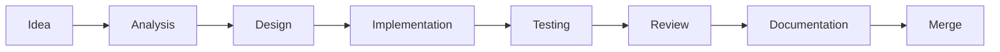
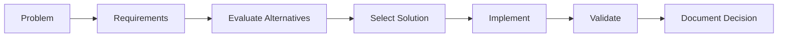

# PlacementHub Contributing Guide

> Engineering Workflow, Development Standards, and Contribution Guidelines

---

## Document Information

| Field | Value |
|--------|-------|
| Document Name | Contributing Guide |
| Project | PlacementHub |
| Version | 1.0.0 |
| Status | Draft |
| Owner | Anand Sagar |
| Scope | Engineering Workflow |
| Parent Document | 00_PROJECT_DNA.md |
| Last Updated | 2026-08-03 |

---

## Purpose

This document defines the engineering workflow, contribution standards, development practices, review process, and collaboration guidelines for the PlacementHub project.

It establishes a consistent process for implementing new features, fixing defects, improving documentation, and evolving the system while maintaining engineering quality.

---

## Audience

This document is intended for:

- Backend Developers
- Frontend Developers
- Full-Stack Developers
- Technical Reviewers
- Future Contributors
- AI Coding Assistants

---

## Scope

This guide documents development workflow, branching strategy, coding standards, documentation expectations, review practices, and contribution lifecycle.

Business rules and implementation details are documented separately.

---

# Engineering Philosophy

Every contribution should improve the overall quality of the platform.

Development decisions should prioritize:

- Maintainability
- Readability
- Security
- Consistency
- Simplicity
- Reliability
- Scalability

Contributors are expected to follow the architectural principles defined in the Project DNA rather than introducing isolated implementation patterns.

---

# Contribution Workflow

Every engineering change should follow a predictable lifecycle.

Every contribution should complete each stage before integration into the main branch.

---

# Development Workflow

Development should proceed through the following sequence.

1. Understand the business requirement.
2. Review relevant documentation.
3. Design the solution.
4. Implement the feature.
5. Execute testing.
6. Update documentation.
7. Submit for review.
8. Merge after approval.

Skipping documentation or testing is discouraged except for emergency operational fixes.

---

# Branch Strategy

The project follows a simple Git workflow.

| Branch | Purpose |
|---------|----------|
| main | Stable production-ready code |
| feature/* | New features |
| fix/* | Bug fixes |
| docs/* | Documentation updates |
| refactor/* | Internal improvements |
| experiment/* | Research and prototypes |

Long-running branches should be avoided whenever practical.

---

# Commit Standards

Commits should remain focused on a single logical change.

Recommended commit prefixes include:

| Prefix | Purpose |
|---------|----------|
| feat | New functionality |
| fix | Bug fixes |
| docs | Documentation |
| refactor | Internal improvements |
| test | Testing |
| chore | Maintenance |
| perf | Performance improvements |

Examples:

- feat(auth): implement OTP verification
- fix(api): resolve application status update
- docs(database): update schema documentation
- refactor(users): simplify profile calculation

Commit messages should clearly communicate intent rather than implementation details.

---

# Code Quality Standards

Every contribution should satisfy the following quality expectations.

- Readable code.
- Consistent naming.
- Minimal duplication.
- Clear responsibility boundaries.
- Appropriate documentation.
- Automated verification where applicable.
- No unnecessary complexity.
- No dead code.

Engineering quality takes precedence over implementation speed.

---

# Documentation Requirements

Documentation should evolve together with the implementation.

Documentation updates are expected whenever changes affect:

- Architecture
- APIs
- Database schema
- Security
- Deployment
- Testing
- Business workflows

Documentation should remain synchronized with the current implementation.

---

# Code Review

Every significant contribution should undergo technical review.

Review should evaluate:

- Correctness
- Readability
- Security
- Architecture compliance
- Performance impact
- Testing coverage
- Documentation completeness

Code review is intended to improve engineering quality rather than assign blame.

---

# Pull Request Guidelines

Pull requests should:

- Address one logical objective.
- Include relevant testing.
- Update documentation where required.
- Remain reasonably sized.
- Explain architectural decisions when appropriate.

Large unrelated changes should be divided into multiple pull requests whenever practical.

---

# Documentation Review

Documentation should be treated as part of the software itself.

Every architectural, functional, or operational change should be reflected in the appropriate engineering document before the change is considered complete.

Documentation reviews should verify:

- Accuracy
- Completeness
- Consistency
- Cross-document references
- Version alignment

Documentation should remain synchronized with the implementation at all times.

---

# Testing Expectations

Every contribution should include an appropriate level of verification.

Typical expectations include:

- Unit testing where applicable.
- Integration testing for workflow changes.
- API verification for backend changes.
- Frontend verification for UI changes.
- Regression testing for modified functionality.

Contributors should not merge changes that have not been reasonably validated.

---

# Dependency Management

Third-party libraries should be introduced only when they provide clear long-term value.

Before adding a dependency, contributors should evaluate:

- Maintenance activity.
- Community adoption.
- Security history.
- License compatibility.
- Long-term sustainability.

Unused dependencies should be removed periodically to reduce maintenance overhead.

---

# Refactoring Guidelines

Refactoring should improve code quality without changing externally observable behavior.

Acceptable refactoring objectives include:

- Improved readability.
- Reduced duplication.
- Better modularity.
- Simplified logic.
- Improved maintainability.
- Performance improvements without changing functionality.

Large refactoring efforts should be planned and documented before implementation.

---

# Communication Standards

Engineering communication should remain clear, concise, and evidence-based.

Contributors should:

- Explain architectural decisions.
- Document assumptions.
- Record trade-offs.
- Raise risks early.
- Prefer objective technical discussion over personal preference.

Technical discussions should focus on improving the platform rather than defending individual implementations.

---

# Definition of Done

A contribution is considered complete only when all applicable conditions have been satisfied.

## Functional Completion

- Feature behaves as intended.
- Business requirements are satisfied.
- Edge cases have been considered.

---

## Engineering Completion

- Code follows project standards.
- Architecture remains consistent.
- No unnecessary duplication.
- No known critical defects introduced.

---

## Verification Completion

- Appropriate testing completed.
- Regression risks evaluated.
- Manual verification performed where necessary.

---

## Documentation Completion

Required engineering documents have been updated whenever applicable.

Examples include:

- Architecture
- System Design
- Database Schema
- API Reference
- Frontend Guide
- Backend Guide
- Security Guide
- Deployment Guide
- Testing Guide

Documentation should never lag behind implementation.

---

# Engineering Decision Process

Significant technical decisions should follow a structured evaluation process.

This process encourages deliberate engineering decisions and creates a clear history of why major technical choices were made.

---

# Open Source Considerations

If PlacementHub is developed with external contributors in the future, contributors should additionally:

- Respect the project's coding standards.
- Follow the documented engineering workflow.
- Keep pull requests focused.
- Maintain respectful technical discussions.
- Accept review feedback constructively.
- Preserve documentation quality.

The same engineering expectations apply regardless of contributor experience.

---

# Related Documentation

This document should be read together with:

- 00_PROJECT_DNA.md
- 01_ARCHITECTURE.md
- 02_SYSTEM_DESIGN.md
- 03_DATABASE_SCHEMA.md
- 04_API_REFERENCE.md
- 05_FRONTEND_GUIDE.md
- 06_BACKEND_GUIDE.md
- 07_SECURITY.md
- 08_DEPLOYMENT.md
- 09_TESTING.md
- 11_ROADMAP.md
- 12_CHANGELOG.md

---

# Revision History

| Version | Date | Description |
|----------|------|-------------|
| 1.0.0 | 2026-08-03 | Initial engineering contribution guide. |
