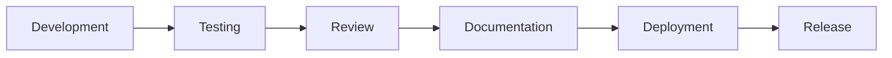

# PlacementHub Changelog

> Official Release History and Version Management

---

## Document Information

| Field | Value |
|--------|-------|
| Document Name | Changelog |
| Project | PlacementHub |
| Version | 1.0.0 |
| Status | Living Document |
| Owner | Anand Sagar |
| Scope | Release History |
| Parent Document | 00_PROJECT_DNA.md |
| Last Updated | 2026-08-03 |

---

## Purpose

This document records the official release history of PlacementHub.

It provides a chronological record of significant architectural, functional, security, infrastructure, documentation, and operational changes introduced throughout the project lifecycle.

The changelog serves as the authoritative reference for version history.

---

## Audience

This document is intended for:

- Developers
- Technical Reviewers
- Contributors
- Release Managers
- AI Coding Assistants

---

## Scope

This document tracks released changes only.

Planned work is documented in **11_ROADMAP.md**.

---

# Changelog Policy

PlacementHub follows the principles of **Keep a Changelog** while adapting the format to the project's engineering documentation standards.

Each release should record:

- New Features
- Improvements
- Bug Fixes
- Security Updates
- Performance Improvements
- Infrastructure Changes
- Documentation Updates
- Breaking Changes (if any)

Only released work should appear in this document.

---

# Semantic Versioning

PlacementHub follows Semantic Versioning.

```
MAJOR.MINOR.PATCH
```

Meaning:

| Version | Purpose |
|----------|----------|
| MAJOR | Breaking architectural or API changes |
| MINOR | New backward-compatible functionality |
| PATCH | Bug fixes and small improvements |

Examples:

```
1.0.0

1.1.0

1.1.3

2.0.0
```

---

# Release Categories

Every release may include one or more categories.

| Category | Description |
|----------|-------------|
| Added | New functionality |
| Changed | Existing functionality modified |
| Fixed | Bug fixes |
| Improved | Performance or usability improvements |
| Security | Security enhancements |
| Infrastructure | Deployment and operational improvements |
| Documentation | Documentation updates |
| Deprecated | Features scheduled for removal |
| Removed | Deleted functionality |

---

# Version 1.0.0

Release Date: TBD

Status: In Development

---

## Added

- Core project architecture
- Authentication
- Student management
- Recruiter management
- Placement administration
- Job management
- Applications
- Campus drives
- Interviews
- Offers
- Notifications
- Events
- AI integration

---

## Infrastructure

- React frontend
- FastAPI backend
- MongoDB Atlas
- Cloudinary integration
- Google Gemini integration
- Render deployment
- Vercel deployment

---

## Documentation

Established enterprise engineering documentation including:

- Project DNA
- Architecture
- System Design
- Database Schema
- API Reference
- Frontend Guide
- Backend Guide
- Security Guide
- Deployment Guide
- Testing Guide
- Contributing Guide
- Roadmap

---

## Security

- JWT Authentication
- RBAC Authorization
- Password hashing
- OTP password reset
- Audit logging

---

## Known Limitations

- Backend remains centralized within a single FastAPI application.
- Staging environment is not yet available.
- CI/CD pipeline is planned.
- Containerization is planned.

---

# Breaking Changes

Breaking changes should be documented before release.

Each breaking change should include:

- Affected components
- Migration requirements
- Compatibility considerations
- Recommended upgrade procedure

If a release contains no breaking changes, this section should explicitly state that.

---

# Deprecation Policy

Features scheduled for future removal should first be marked as deprecated.

Deprecation notices should include:

- Reason
- Planned removal version
- Migration guidance
- Replacement feature

Deprecated functionality should remain supported for a reasonable transition period whenever practical.

---

# Migration Notes

When releases require operational or implementation changes, migration guidance should be documented here.

Examples include:

- Database schema updates
- API modifications
- Environment variable changes
- Deployment procedure updates
- Configuration updates

Migration documentation should minimize upgrade risk.

---

# Known Issues

Known issues should be tracked until resolved.

Each issue should include:

- Description
- Impact
- Temporary workaround (if available)
- Planned resolution

Only confirmed issues should be documented.

---

# Future Releases

Planned releases should remain high level.

Detailed planning belongs in:

- 11_ROADMAP.md

The changelog records released work, not implementation plans.

---

# Release Approval Process

Every production release should complete the following workflow.



A release should not be considered complete until documentation has been updated and deployment has been verified.

---

# Related Documentation

This document should be read together with:

- 00_PROJECT_DNA.md
- 01_ARCHITECTURE.md
- 02_SYSTEM_DESIGN.md
- 03_DATABASE_SCHEMA.md
- 04_API_REFERENCE.md
- 05_FRONTEND_GUIDE.md
- 06_BACKEND_GUIDE.md
- 07_SECURITY.md
- 08_DEPLOYMENT.md
- 09_TESTING.md
- 10_CONTRIBUTING.md
- 11_ROADMAP.md

---

# Revision History

| Version | Date | Description |
|----------|------|-------------|
| 1.0.0 | 2026-08-03 | Initial changelog and release management guide. |

